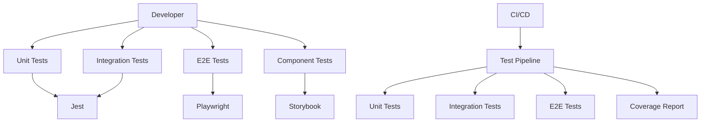

# Testowanie Overview

> [!TIP] Źródło tematu: Testowanie
> Kanoniczna definicja tematu "Testowanie" - test pyramid, automatyzacja, developer experience.
> Wystąpienia: [technical.md](technical.md), [reference.md](reference.md)

## Concept

System testowania w Next.js 15 Template opiera się na **test pyramid approach** z wielowarstwowym podejściem, które zapewnia kompleksowe pokrycie testami na każdym poziomie aplikacji. Filozofia testowania skupia się na trzech głównych obszarach:

- **Test Pyramid** — optymalne pokrycie przy minimalnym koszcie utrzymania (70% unit, 20% integration, 10% E2E)
- **Testing Strategy** — różne typy testów sprawdzają różne aspekty aplikacji (Jest, Playwright, Storybook)
- **Developer Experience** — płynny workflow testowy z szybkim feedbackiem, łatwym pisaniem testów i automatycznym uruchamianiem

## Problem

Bez odpowiedniego systemu testowania projekt napotyka następujące problemy:

- **Brak automatyzacji** — ręczne testowanie jest czasochłonne i podatne na błędy
- **Trudność utrzymania** — brak struktury testów prowadzi do rozproszonych i niekonsystentnych testów
- **Brak pokrycia** — nie wiadomo, które części aplikacji są testowane, a które nie
- **Późne wykrywanie błędów** — błędy są wykrywane dopiero w produkcji lub podczas ręcznego testowania
- **Wysoki koszt refaktoringu** — brak testów uniemożliwia bezpieczne wprowadzanie zmian
- **Brak dokumentacji** — komponenty nie mają wizualnej dokumentacji i przykładów użycia

## Why?

Wprowadzenie kompleksowego systemu testowania przynosi korzyści biznesowe:

- **Szybki feedback** — błędy są wykrywane natychmiast podczas developmentu, nie w produkcji
- **Mniej regresji** — testy automatyczne zapobiegają wprowadzaniu nowych błędów przy zmianach
- **Łatwiejszy refactoring** — bezpieczne wprowadzanie zmian z pewnością, że nic się nie zepsuło
- **Krótszy time-to-market** — automatyzacja przyspiesza proces developmentu
- **Lepsza dokumentacja** — testy i stories służą jako żywa dokumentacja komponentów
- **Wyższa jakość kodu** — wymuszenie pisania testowalnego kodu poprawia architekturę

## Solution

Rozwiązanie opiera się na trzech narzędziach działających razem w test pyramid:

### Test Pyramid Architecture

### Narzędzia

1. **Jest** — unit i integration testing (70% piramidy)
   - Szybkie, izolowane testy jednostek
   - Testowanie interakcji między modułami
   - Mockowanie zewnętrznych zależności
   - Raportowanie pokrycia testami

2. **Playwright** — E2E testing (10% piramidy)
   - Testowanie pełnych user journeys
   - Cross-browser testing
   - Visual testing
   - Performance testing

3. **Storybook** — component testing i documentation (20% piramidy)
   - Testowanie komponentów w izolacji
   - Visual testing komponentów
   - Dokumentacja komponentów
   - Interaction testing

### Workflow Integration

System testowania jest zintegrowany w cały workflow developmentu:

- **Development Phase** — szybki feedback podczas pisania kodu
- **Commit Phase** — automatyczne uruchamianie testów przed commitem (Husky hooks)
- **CI/CD Phase** — pełny test suite w pipeline automatycznym

Szczegóły workflow: [technical.md](technical.md#testing-workflow)

## Capabilities

System testowania można łatwo adaptować i rozszerzać:

- **Progresywne zaostrzanie** — można zwiększać coverage thresholds stopniowo
- **Dodawanie nowych narzędzi** — łatwa integracja dodatkowych narzędzi testowych (np. Cypress, Vitest)
- **Rozszerzanie workflow** — możliwość dodania custom hooks i automatycznych testów
- **Customizacja coverage** — dostosowanie metryk pokrycia do potrzeb projektu
- **Integracja z CI/CD** — pełna integracja z GitHub Actions i innymi systemami CI/CD
- **External testing** — możliwość testowania webhooków i zewnętrznych integracji przez ngrok

## Wystąpienia

- [`technical.md`](technical.md) — szczegóły implementacji i konfiguracji
- [`tech-jest.md`](tech-jest.md) — szczegóły Jest configuration
- [`tech-playwright.md`](tech-playwright.md) — szczegóły Playwright setup
- [`tech-storybook.md`](tech-storybook.md) — szczegóły Storybook testing
- [`tech-ngrok.md`](tech-ngrok.md) — external testing i webhook testing
- [`reference.md`](reference.md) — kompletna referencja konfiguracji i skryptów
- [`memory-bank/testing.md`](../../../memory-bank/testing.md) — skrót testing dla AI
- [`../9-code-quality/`](../9-code-quality/) — kontekst w code quality
- [`../14-workflow/`](../14-workflow/) — kontekst w development workflow
