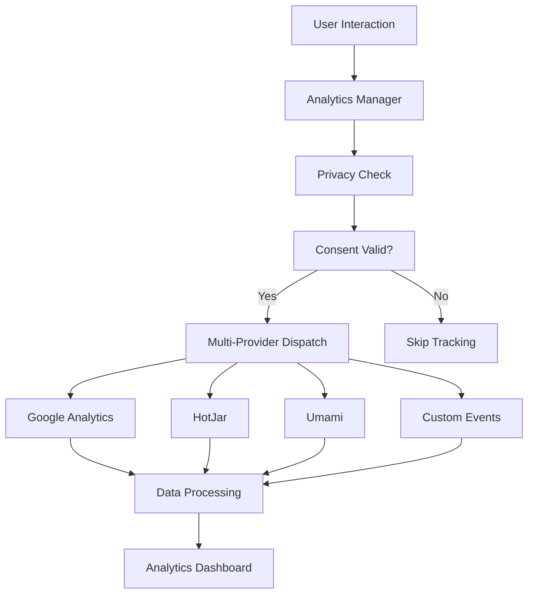

# Analytics Overview

> [!TIP] Źródło tematu
> To jest kanoniczny rozdział. Zachowuje pełny opis (CO, DLACZEGO, JAK).
> Wystąpienia: patrz sekcja „Wystąpienia" na dole.

## Concept

System analityczny w Next.js 15 Template opiera się na **multi-provider approach** z pełnym wsparciem dla prywatności i zgodności z GDPR, zapewniając kompleksowe śledzenie zachowań użytkowników przy zachowaniu ich prywatności.

## Problem

Współczesne aplikacje webowe potrzebują szczegółowych danych o zachowaniach użytkowników, aby podejmować świadome decyzje biznesowe i optymalizować doświadczenia. Jednak zbieranie tych danych napotyka na znaczące wyzwania:

- **Brak widoczności** - Bez odpowiednich narzędzi analitycznych nie widać, jak użytkownicy korzystają z aplikacji, które funkcje są najpopularniejsze i gdzie występują problemy
- **Trudności w optymalizacji konwersji** - Brak danych o ścieżkach użytkowników, punktach opuszczenia i barierach w konwersji uniemożliwia skuteczną optymalizację
- **Niezgodność z regulacjami** - GDPR i inne regulacje prywatności wymagają kompleksowego zarządzania zgodą użytkowników i transparentności w zbieraniu danych
- **Brak danych do decyzji biznesowych** - Bez metryk i analityki trudno ocenić efektywność funkcji, kampanii marketingowych i strategii produktowych

## Why?

System analityczny został zaprojektowany z trzech kluczowych filozofii:

### 1. Privacy-First Analytics

Prywatność użytkowników jest priorytetem, nie opcją. System zapewnia pełną zgodność z GDPR, zarządzanie zgodą na cookies, zbieranie tylko niezbędnych danych i transparentne informowanie o śledzeniu. To buduje zaufanie użytkowników i chroni przed konsekwencjami prawnymi.

### 2. Multi-Provider Strategy

Różne narzędzia służą różnym celom analitycznym. Google Analytics zapewnia główne metryki i konwersje, HotJar oferuje heatmaps i session recordings dla zrozumienia zachowań, Umami dostarcza privacy-focused analytics, a custom events pozwalają na własne metryki biznesowe. Ta elastyczność umożliwia wybór najlepszych narzędzi dla konkretnych potrzeb.

### 3. Performance-Optimized Tracking

Analytics nie może wpływać negatywnie na wydajność aplikacji. System wykorzystuje lazy loading skryptów, nieblokujące ładowanie, conditional loading tylko gdy potrzebne i optymalizację bundle size. To zapewnia, że zbieranie danych nie spowalnia doświadczenia użytkownika.

## Solution

System analityczny rozwiązuje problemy przez zintegrowaną architekturę multi-provider z automatycznym zarządzaniem zgodą użytkownika. Architektura przepływu danych:

### Analytics Tools Stack

**Google Analytics 4** - Główne narzędzie do śledzenia metryk i konwersji, z pełnym wsparciem dla event tracking, conversion tracking, e-commerce tracking i custom dimensions.

**HotJar** - Narzędzie do analizy behawioralnej użytkowników przez heatmaps kliknięć, session recordings, feedback polls i user surveys.

**Umami** - Privacy-focused analytics z własnym hostingiem, lekkim rozwiązaniem i pełną zgodnością z GDPR.

**Custom Events** - Własne metryki biznesowe, performance tracking, error tracking i user journey tracking.

System automatycznie zarządza inicjalizacją providerów, sprawdzaniem zgody użytkownika i wysyłaniem eventów do odpowiednich narzędzi, zapewniając spójne i niezawodne śledzenie danych.

## Capabilities

System analityczny oferuje szeroki zakres możliwości analitycznych i zgodności z regulacjami:

### Privacy & Compliance

**GDPR Compliance** - Pełna zgodność z regulacjami prywatności przez system zarządzania zgodą użytkownika. Użytkownik może zaakceptować wszystkie cookies, tylko essential lub odrzucić wszystkie, co automatycznie kontroluje aktywność providerów.

**Cookie Management** - Kategoryzacja cookies, zarządzanie zgodą, opcje rezygnacji i kontrolowany okres przechowywania danych.

**Data Protection** - Anonimizacja danych, szyfrowanie transmisji, bezpieczna transmisja i regularne audyty bezpieczeństwa.

### Analytics Dashboard

**Real-time Metrics** - Monitoring aktywnych użytkowników, page views, eventów w czasie rzeczywistym i konwersji w czasie rzeczywistym.

**Historical Data** - Analiza trendów w czasie, porównania okresów, segmentacja użytkowników i analiza kohort dla długoterminowych insights.

**Custom Reports** - Tworzenie raportów dla kluczowych wskaźników biznesowych (KPIs), metryk wydajności, analizy zachowań użytkowników i lejków konwersji.

### Adaptability

System można łatwo rozszerzyć o dodatkowe providery, custom event types i integracje z zewnętrznymi narzędziami. Wszystkie komponenty są modularne i konfigurowalne przez centralny config system.

## Occurrences

- [`technical.md`](technical.md) — szczegóły implementacji i konfiguracji
- [`tech-google-analytics.md`](tech-google-analytics.md) — szczegóły Google Analytics
- [`tech-hotjar.md`](tech-hotjar.md) — szczegóły HotJar
- [`tech-umami.md`](tech-umami.md) — szczegóły Umami
- [`reference.md`](reference.md) — kompletna referencja API i typów
- [`memory-bank/techContext.md`](../../../memory-bank/techContext.md) — skrót analytics dla AI
- [`../11-performance/`](../11-performance/) — kontekst w performance monitoring
- [`../14-workflow/`](../14-workflow/) — kontekst w development workflow
