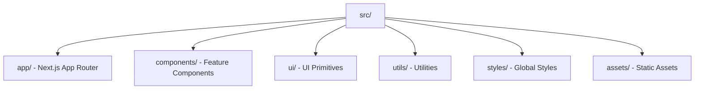

# Przewodnik techniczny zapoznania z szablonem

> [!NOTE] Wystąpienie tematu
> Szczegółowy przewodnik implementacji.
> Źródło koncepcji: [overview.md](overview.md)

## Prerequisites

**Wymagane narzędzia:**

- **Node.js** 18.17+ (zalecane 20.x)
- **yarn** 1.22+ (zalecane 3.x+)
- **Git** 2.30+
- **IDE:** Zalecane jest używanie **Cursor** lub **VS Code** (opcjonalnie).
- **Rozszerzenia VS Code:** Użyj instalatora zalecanych rozszerzeń dostępnego w repozytorium: uruchom `yarn setup:vscode` albo odpowiedni skrypt opisany w [`/.vscode/extensions.json`](../../../.vscode/extensions.json), aby automatycznie zainstalować wymagane pluginy.
  Dokumentacja konfiguracji VS Code: [https://code.visualstudio.com/docs/editor/extension-marketplace](https://code.visualstudio.com/docs/editor/extension-marketplace)

**Weryfikacja:**

```bash
node --version    # >= 18.17.0
yarn --version    # >= 1.22.0
git --version     # >= 2.30.0
lsof -i :3000     # Port deweloperski
lsof -i :6006     # Storybook
```

## Installation

### 1. Setup Podstawowy

```bash
# Klonuj i skonfiguruj
git clone <repository-url>
cd <project-directory>
yarn install
yarn s-update-manager
```

### 2. Customizacja

```bash
# Edytuj konfigurację w pliku tools/customize/customize.config.ts
# ręcznie lub za pomocą nano:
nano tools/customize/customize.config.ts

# Uruchom customizację
yarn customize

# Sprawdź czy wszystkie placeholdery zostały zastąpione
grep -r "{{PLACEHOLDER_" . --exclude-dir=node_modules --exclude-dir=.git
```

**Szczegóły konfiguracji**: Zobacz [Customization - Technical Guide](../2-customization/technical.md)

### 3. Pierwsze Uruchomienie

```bash
# Development
yarn dev
open http://localhost:3000

# Weryfikacja
yarn test && yarn lint && yarn type-check && yarn storybook && yarn build
```

## Optional Setup

### Environment Variables

> [!NOTE] Wystąpienie tematu: Environment Setup
> Podstawowy setup environment variables w procesie instalacji.
> Źródło: [3-environment/technical.md#setup-t3-env](../3-environment/technical.md#setup-t3-env)

```bash
cp .env.example .env.local
nano .env.local
```

### Ngrok Integration

Ngrok umożliwia tunelowanie lokalnego serwera przez internet (np. do testów webhooków, mobile testing).

```bash
# 1. Zarejestruj się na ngrok.com
# 2. Dodaj token: NGROK_AUTH_TOKEN=twoj-token
# 3. Uruchom tunel
yarn dev:tunnel
```

**Szczegóły:** Zobacz [Testing - Ngrok](../10-testing/tech-ngrok.md)

## Struktura Projektu



**Szczegóły**: [Architecture - Struktura Projektu](../7-architecture/overview.md#struktura-projektu)

## Pierwszy Komponent

```typescript
// src/components/MyComponent/MyComponent.tsx
import { cva, type VariantProps } from 'class-variance-authority';
import { cn } from '@/utils/utils';

const myComponentVariants = cva('rounded-lg p-4', {
  variants: {
    variant: {
      default: 'bg-white text-gray-900',
      primary: 'bg-blue-500 text-white',
    },
  },
  defaultVariants: { variant: 'default' },
});

export interface MyComponentProps
  extends React.HTMLAttributes<HTMLDivElement>,
    VariantProps<typeof myComponentVariants> {}

export function MyComponent({ className, variant, ...props }: MyComponentProps) {
  return (
    <div className={cn(myComponentVariants({ variant, className }))} {...props}>
      Hello World!
    </div>
  );
}
```

**Szczegóły**: [Architecture - Components](../7-architecture/tech-components.md)

## Development Workflow

```bash
# Podstawowy workflow
git pull origin main
git checkout -b feature/my-feature
# ... development ...

# Post-development flow
gaa   # git add .
gc    # commitizen CLI - auto fill commit message
git push origin feature/my-feature
```

**Szczegóły**: [Workflow Guide](../14-workflow/README.md)

## Narzędzia Deweloperskie

```bash
# Development
yarn dev              # Next.js server
yarn storybook        # Component docs

# Analysis
yarn analyze          # Bundle size
yarn knip             # Unused code
yarn madge            # Circular deps

# Testing
yarn test:watch       # Unit tests
yarn test:e2e         # E2E tests
```

**Szczegóły**: [Developer Experience](../2-developer-experience/) — pełna lista narzędzi

## Git Hooks

**Automatyczne sprawdzanie jakości:**

- **pre-commit**: ESLint + Prettier + TypeScript
- **commit-msg**: Commitlint (Conventional Commits)
- **prepare-commit-msg**: Auto-formatowanie z Linear

**Szczegóły**: [Code Quality - Husky](../9-code-quality/tech-husky.md)

## Troubleshooting

### Port 3000 zajęty

```bash
lsof -i :3000
kill -9 <PID>
# Lub: yarn dev --port 3001
```

### Błędy TypeScript

```bash
yarn tsc --noEmit
rm -rf .next node_modules/.cache
yarn build
```

### Testy nie działają

```bash
yarn test --clearCache
cat jest.config.js
```

### Storybook nie uruchamia się

```bash
rm -rf storybook-static
yarn storybook
```

## Wystąpienia

- [`overview.md`](overview.md) — koncepcja i filozofia projektu
- [`../2-customization/`](../2-customization/) — szczegóły customizacji
- [`../2-developer-experience/`](../2-developer-experience/) — narzędzia deweloperskie
- [`../7-architecture/`](../7-architecture/) — struktura projektu i architektura
- [`../14-workflow/`](../14-workflow/) — development workflow
- [`package.json`](../../../package.json) — dependencies i skrypty (reference)
