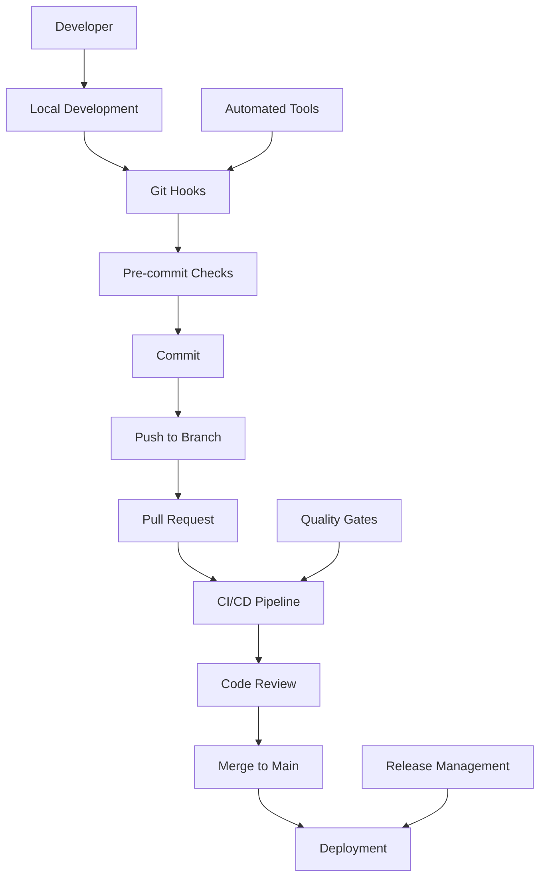

# Workflow Overview

> [!TIP] Źródło tematu
> To jest kanoniczny rozdział. Zachowuje pełny opis (CO, DLACZEGO, JAK).
> Wystąpienia: patrz sekcja „Wystąpienia" na dole.

## Concept

System workflow w Next.js 15 Template opiera się na **Git-based development workflow** z automatycznymi procesami, zapewniając spójny, skalowalny i wydajny proces rozwoju aplikacji. Workflow integruje version control, automated quality gates, CI/CD pipeline i release management w jeden spójny system wspierający współpracę zespołową i ciągłą dostawę wartości.

## Problem

Przed wprowadzeniem zunifikowanego workflow zespoły napotykały na szereg problemów w procesie developmentu:

- **Brak standaryzacji** — każdy developer używał innego procesu commita, brak spójnych konwencji commit messages
- **Błędy ludzkie** — manualne sprawdzanie jakości kodu przed commitem/deploy prowadziło do błędów w produkcji
- **Brak automatycznych quality gates** — kod niskiej jakości trafiał do repozytorium i produkcyjnego środowiska
- **Trudności w współpracy** — brak transparentnego procesu code review i merge strategy powodował konflikty
- **Brak kontroli nad release'ami** — manualne wersjonowanie i brak automatycznego changelog generowało chaos w zarządzaniu wersjami
- **Brak integracji narzędzi** — rozproszone narzędzia (Git, CI/CD, issue tracking) działały niezależnie

Te problemy spowalniały development, zwiększały ryzyko błędów i utrudniały skalowanie zespołu.

## Why?

Workflow został zaprojektowany, aby rozwiązać powyższe problemy poprzez automatyzację i standaryzację całego procesu developmentu.

**Problem → Solution → Business Value:**

1. **Standaryzacja procesu** — Git hooks i Conventional Commits zapewniają spójność we wszystkich commitach, co redukuje czas na code review i ułatwia automatyczne generowanie changelog

2. **Automatyzacja quality gates** — Pre-commit hooks automatycznie sprawdzają jakość kodu przed commitem, eliminując błędy na wczesnym etapie. CI/CD pipeline zapewnia dodatkową weryfikację przed deploymentem

3. **Integracja narzędzi** — Linear issue tracking jest zintegrowany z Git workflow, zapewniając automatyczne linkowanie commitów z issue i tracking statusu w jednym miejscu

4. **Transparentny proces** — Jasno zdefiniowany branching strategy i code review process zapewniają transparentność i przewidywalność procesu developmentu

5. **Automatyczne release management** — Semantic Release automatycznie generuje wersje, changelog i GitHub releases na podstawie commit messages, eliminując manualne błędy

**Business Value:**

- Redukcja czasu na code review i bug fixing
- Zwiększenie prędkości developmentu przez automatyzację
- Lepsza jakość kodu przez automatyczne quality gates
- Łatwiejsze skalowanie zespołu przez standaryzację
- Mniejsze ryzyko błędów w produkcji przez wieloetapowe weryfikacje

Workflow integruje się z innymi domenami: [Issue Tracking](../5-issue-tracking/) dla Linear integration, [Deployment](../15-deployment/) dla CI/CD automation, i [Code Quality](../9-code-quality/) dla quality gates.

## Solution

System workflow rozwiązuje problemy poprzez wielowarstwową architekturę automatyzacji i standaryzacji:

### Git-Based Development Flow

Workflow opiera się na Git jako centralnym systemie kontroli wersji. Każda zmiana przechodzi przez zdefiniowany proces: feature branch → development → code review → merge → deployment. Branching strategy zapewnia izolację funkcjonalności i bezpieczne mergowanie zmian.

### Automated Quality Gates

Quality gates są automatycznie egzekwowane na każdym etapie procesu:

- **Pre-commit hooks** — automatyczne sprawdzanie formatowania, linting i testy przed commitem
- **Pull Request checks** — pełna weryfikacja jakości w CI/CD pipeline przed code review
- **Pre-deployment gates** — testy i smoke tests przed wdrożeniem na produkcję

### Integrated CI/CD Pipeline

CI/CD pipeline automatycznie uruchamia się przy każdym push i pull request, wykonując pełną weryfikację kodu, testy i build. Po pomyślnej weryfikacji automatycznie wdraża aplikację na odpowiednie środowisko (staging/production) zgodnie z branching strategy.

### Automated Release Management

Semantic Release automatycznie analizuje commit messages, generuje wersje zgodnie z Conventional Commits, tworzy changelog z linkami do Linear issues i publikuje GitHub releases. Proces jest w pełni automatyczny, eliminując błędy ludzkie w wersjonowaniu.

### Branching Strategy

System używa Git Flow z branchami: `main` (production), `develop` (integration), `feature/*` (nowe funkcje), `hotfix/*` (krytyczne poprawki), `release/*` (przygotowanie release). Merge strategy zapewnia bezpieczne wprowadzanie zmian do produkcji.

## Capabilities

Workflow system można dostosować do potrzeb projektu:

### Customization Git Hooks

Można rozszerzyć lub zmodyfikować Git hooks (pre-commit, pre-push) o dodatkowe sprawdzenia, np. security scanning, custom validations, czy integracje z zewnętrznymi narzędziami.

### Extension CI/CD Pipeline

GitHub Actions workflows można rozszerzyć o dodatkowe joby: performance testing, security scanning, bundle analysis, czy deployment na dodatkowe środowiska.

### Additional Quality Gates

Można dodać dodatkowe quality gates na różnych etapach procesu: code coverage thresholds, complexity checks, dependency vulnerability scanning, czy custom business rules validation.

### Integration with External Tools

Workflow można zintegrować z dodatkowymi narzędziami: Slack notifications, Jira integration, custom analytics, czy monitoring tools.

### Branching Strategy Adaptation

Można dostosować branching strategy do potrzeb projektu: dodanie branchy `staging`, `preprod`, zmiana merge strategy, czy implementacja GitLab Flow zamiast Git Flow.

### Custom Commit Conventions

Można rozszerzyć Conventional Commits o custom types, zmienić format commit messages, czy dostosować commitlint rules do potrzeb zespołu.

Wszystkie te dostosowania zachowują spójność z podstawową architekturą workflow, zapewniając elastyczność przy zachowaniu benefits automatyzacji.

## Occurrences

- [`technical.md`](technical.md) — szczegóły implementacji i konfiguracji
- [`reference.md`](reference.md) — kompletna referencja techniczna workflow
- [`memory-bank/workflows.md`](../../../memory-bank/workflows.md) — skrót workflow dla AI
- [`../1-getting-started/`](../1-getting-started/) — workflow w getting started
- [`../5-issue-tracking/`](../5-issue-tracking/) — kontekst Linear + GitHub workflow
- [`../15-deployment/`](../15-deployment/) — szczegóły deployment workflow
