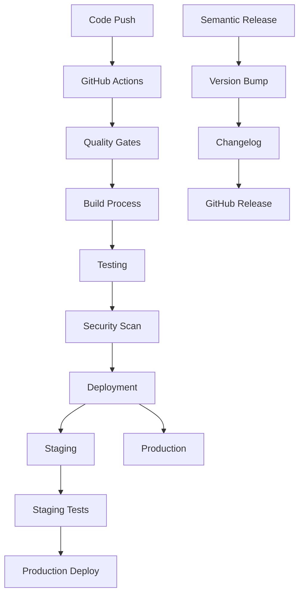

# Budowa i wdrażanie Overview

> [!TIP] Źródło tematu: Budowa i wdrażanie
> Kanoniczna definicja tematu "Budowa i wdrażanie" - CI/CD, automatyzacja deploymentu, semantic release.
> Wystąpienia: [technical.md](technical.md), [reference.md](reference.md)

## Concept

System budowania i wdrażania w Next.js 15 Template opiera się na **automatyzacji CI/CD** z wieloetapowym pipeline'em, który zapewnia bezpieczne i niezawodne wdrażanie aplikacji na różnych środowiskach.

Automatyzacja obejmuje pełny cykl od commita do wdrożenia: automatyczne testy, budowanie aplikacji, wersjonowanie i wdrażanie na odpowiednie środowisko w zależności od typu brancha.

## Problem

Manualne procesy wdrażania aplikacji niosą ze sobą wiele wyzwań:

- **Ryzyko błędów ludzkich** - ręczne kopiowanie plików, konfiguracja serwerów, zarządzanie wersjami
- **Brak spójności** - różne środowiska mogą mieć różne konfiguracje, prowadząc do problemów typu "działa na moim komputerze"
- **Długi czas wdrożenia** - manualne kroki wydłużają proces od commita do production
- **Trudność w śledzeniu zmian** - brak automatycznego wersjonowania i changelog
- **Brak quality gates** - możliwość wdrożenia nieprzetestowanego kodu
- **Złożoność zarządzania środowiskami** - ręczne mapowanie branchy na środowiska, zarządzanie sekretami

Te problemy prowadzą do wolniejszego rozwoju, większej liczby błędów w produkcji i trudności w utrzymaniu wysokiej jakości aplikacji.

## Why?

Automatyzacja procesu build & deploy przynosi znaczące korzyści biznesowe:

**Redukcja błędów i zwiększenie niezawodności:**

- Automatyczne procesy eliminują błędy ludzkie
- Spójne środowiska zapewniają identyczne warunki od development do production
- Automatyczne testy i quality gates blokują wdrożenie nieprzetestowanego kodu

**Przyspieszenie rozwoju:**

- Szybsze wdrożenia dzięki automatyzacji
- Developerzy mogą skupić się na kodzie, nie na procesach wdrażania
- Automatyczne wersjonowanie i changelog eliminują ręczną pracę

**Lepsza transparentność:**

- Automatyczne śledzenie zmian przez wersjonowanie
- Pełna historia wdrożeń w GitHub Actions
- Integracja z Linear dla śledzenia issue w release notes

**Skalowalność:**

- System może obsługiwać wiele środowisk jednocześnie
- Automatyczne mapowanie branchy na środowiska
- Możliwość równoległego wdrażania wielu feature branches

**Bezpieczeństwo:**

- Centralne zarządzanie sekretami w GitHub Secrets
- Automatyczne sprawdzanie jakości przed wdrożeniem
- Weryfikacja konfiguracji przez T3 Env

## Solution

Projekt używa kompleksowego rozwiązania opartego na GitHub Actions i Semantic Release, które automatycznie obsługuje cały proces od commita do wdrożenia.

### Automatyzacja CI/CD

GitHub Actions zapewnia modularny pipeline z reusable workflows:

- **Setup** - automatyczne wykrywanie typu framework i release
- **Linting** - sprawdzanie jakości kodu (ESLint, Prettier, Stylelint, TypeScript)
- **Testing** - automatyczne testy (unit, component, E2E, smoke)
- **Building** - optymalizowane budowanie z cache
- **Release** - automatyczne wersjonowanie i tworzenie release

### Automatyczne Wersjonowanie

Semantic Release analizuje commity i automatycznie:

- Wykrywa typ zmian (feat, fix, breaking change)
- Generuje odpowiednią wersję (major, minor, patch)
- Tworzy changelog z linkami do Linear issues
- Publikuje release na GitHub i NPM

### Multi-Environment Deployment

System automatycznie mapuje branchy na środowiska:

- **Feature branches** → pre-release environment (versioned URLs)
- **Pull requests** → pre-production environment
- **Main branch** → production environment
- **Develop branch** → beta environment

### Quality Gates

Każde wdrożenie przechodzi przez automatyczne kontrole:

- Code quality (linting, type checking)
- Test coverage (unit, component, E2E)
- Build verification
- Security scanning

### Architecture

## Capabilities

System build & deploy może być rozszerzony i dostosowany do różnych potrzeb:

**Dodatkowe środowiska:**

- Możliwość dodania nowych środowisk (np. staging, QA)
- Konfiguracja custom mapping branch → environment
- Obsługa wielu deployment targets (Vercel, AWS, własne serwery)

**Custom workflows:**

- Dodanie własnych reusable workflows
- Integracja z zewnętrznymi narzędziami (Slack notifications, Jira)
- Custom deployment scripts

**Integracje:**

- Rozszerzenie integracji z Linear o dodatkowe metadane
- Integracja z monitoring tools (Sentry, Datadog)
- Automatyczne rollback w przypadku problemów

**Optymalizacja:**

- Fine-tuning cache strategies
- Parallel deployment dla większych aplikacji
- Blue-green deployments

**Advanced features:**

- Feature flags dla gradual rollouts
- A/B testing deployment
- Canary releases

Szczegóły implementacji: [`technical.md`](technical.md), [`tech-github-actions.md`](tech-github-actions.md), [`tech-semantic-release.md`](tech-semantic-release.md)

## Occurrences

- [`technical.md`](technical.md) — szczegóły implementacji i konfiguracji
- [`reference.md`](reference.md) — kompletna techniczna referencja API
- [`tech-environments.md`](tech-environments.md) — strategia środowisk i mapowanie branchy
- [`tech-github-actions.md`](tech-github-actions.md) — szczegóły GitHub Actions
- [`tech-semantic-release.md`](tech-semantic-release.md) — szczegóły Semantic Release
- [`tech-github-actions-release.md`](tech-github-actions-release.md) — automatyzacja release
- [`memory-bank/workflows.md`](../../../memory-bank/workflows.md) — skrót build & deploy dla AI
- [`../14-workflow/`](../14-workflow/) — kontekst w development workflow
- [`../10-testing/`](../10-testing/) — kontekst w testing strategy
