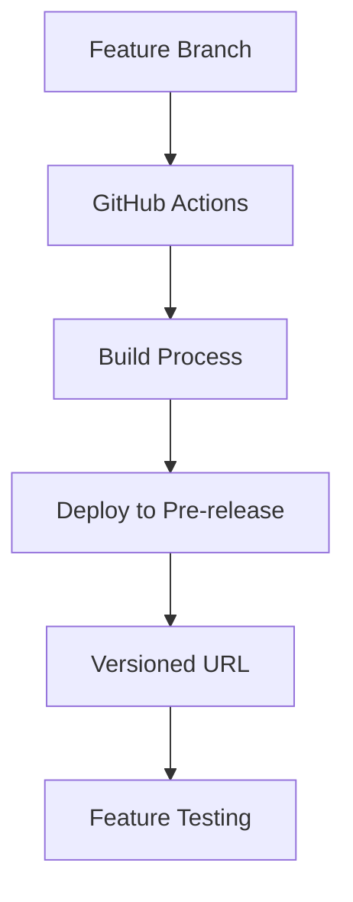
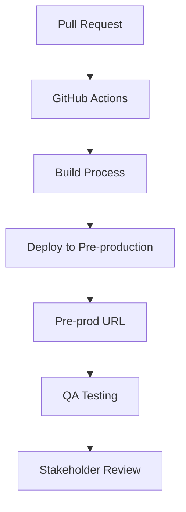
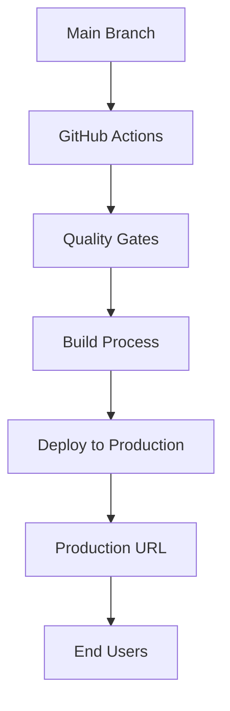
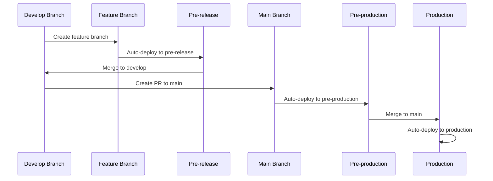

# Environment Strategy

> [!NOTE] Wystąpienie tematu
> Szczegółowy przewodnik implementacji.
> Źródło koncepcji: [overview.md](overview.md)

### Pre-release Environment

**Źródło:** Feature branches (`feature/*`) i dev branch

**Trigger:** Każdy commit do feature branches automatycznie uruchamia deployment

**Environment:** Versioned link (np. `https://feature-name-v1.2.3.domain.com`)

**Purpose:** Pozwala na testowanie i weryfikację nowych funkcjonalności przed włączeniem ich do głównego release

**Note:** Każda wersja jest identyfikowalna przez unikalny URL zawierający nazwę feature i numer wersji



### Pre-production Environment

**Źródło:** Pull request do main branch

**Trigger:** Pull request automatycznie generuje test environment

**Environment:** Zdefiniowana domena (np. `https://pre-prod.domain.com`)

**Purpose:** Finalna weryfikacja przed production release

**Note:** Pozwala zespołowi QA i innym stakeholderom testować kompletną aplikację w środowisku podobnym do production



### Production Environment

**Źródło:** Każdy commit na main branch

**Trigger:** Automatyczny deployment przez GitHub Actions

**Environment:** Production (np. `https://domain.com`)

**Purpose:** Dostarczenie finalnej wersji aplikacji do end users

**Note:** Każdy commit do main branch jest traktowany jako production-ready i automatycznie wdrażany



## Branch-to-Environment Mapping

### Feature Development Flow



### Environment Configuration

Deployment jest automatycznie wykonywany przez GitHub Actions workflow. Szczegóły: [`tech-github-actions-release.md`](tech-github-actions-release.md)

**Workflow:**
- Feature branches → Pre-release environment (automatycznie)
- PR do main → Pre-production environment (automatycznie)
- Merge do main → Production environment (automatycznie)

## URL Patterns

### Pre-release URLs

```
https://feature-name-v1.2.3.domain.com
https://user-auth-v2.1.0.domain.com
https://dashboard-ui-v1.0.5.domain.com
```

### Pre-production URLs

```
https://pre-prod.domain.com
https://staging.domain.com
```

### Production URLs

```
https://domain.com
https://app.domain.com
```

## Environment Variables

### Pre-release Environment

```bash
# .env.pre-release
NODE_ENV=development
NEXT_PUBLIC_APP_URL=https://feature-name-v1.2.3.domain.com
NEXT_PUBLIC_DEBUG_MODE=true
```

### Pre-production Environment

```bash
# .env.pre-production
NODE_ENV=production
NEXT_PUBLIC_APP_URL=https://pre-prod.domain.com
NEXT_PUBLIC_DEBUG_MODE=false
```

### Production Environment

```bash
# .env.production
NODE_ENV=production
NEXT_PUBLIC_APP_URL=https://domain.com
NEXT_PUBLIC_DEBUG_MODE=false
```

## Quality Gates per Environment

### Pre-release Quality Gates

- ✅ **Basic Tests** - Unit tests must pass
- ✅ **Linting** - Code style validation
- ✅ **Type Checking** - TypeScript validation
- ⚠️ **Integration Tests** - Optional, can fail
- ❌ **E2E Tests** - Not required

### Pre-production Quality Gates

- ✅ **Full Test Suite** - All tests must pass
- ✅ **E2E Tests** - End-to-end validation
- ✅ **Performance Tests** - Load testing
- ✅ **Security Scan** - Vulnerability check
- ✅ **Code Coverage** - Minimum 80% coverage

### Production Quality Gates

- ✅ **All Pre-production Gates** - Must pass
- ✅ **Smoke Tests** - Post-deployment validation
- ✅ **Health Checks** - Service availability
- ✅ **Monitoring** - Real-time monitoring setup
- ✅ **Rollback Ready** - Rollback strategy in place

## Monitoring

Monitoring i alerting są konfigurowane per environment. Health checks są dostępne przez `/api/health` endpoint (konfiguracja w `next.config.ts`).

## Rollback Strategy

### Pre-release Rollback

```bash
# Automatic rollback on feature branch deletion
git branch -D feature/user-authentication
# → Automatic cleanup of pre-release environment
```

### Pre-production Rollback

```bash
# Rollback by closing PR
# → Automatic cleanup of pre-production environment
```

### Production Rollback

```bash
# Rollback to previous commit
git revert HEAD
git push origin main
# → Automatic rollback deployment
```

## Wystąpienia

- [`overview.md`](overview.md) — koncepcja build & deploy
- [`technical.md`](technical.md) — implementacja deployment
- [`../14-workflow/`](../14-workflow/) — kontekst w development workflow
- [`../10-testing/`](../10-testing/) — testing strategy per environment
