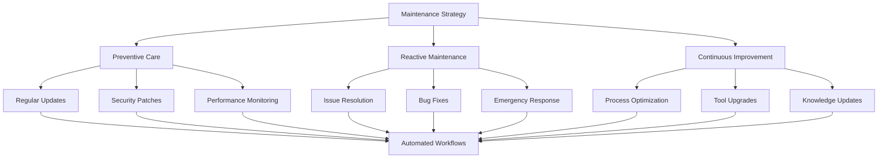
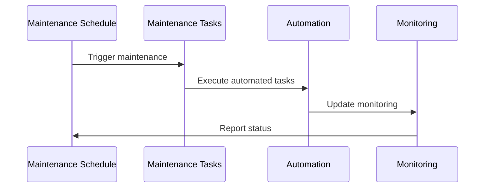
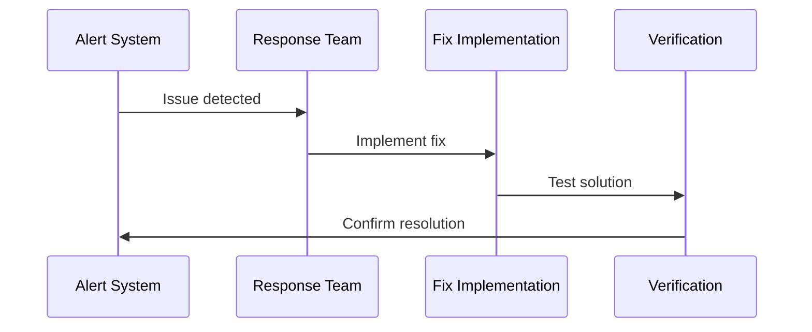
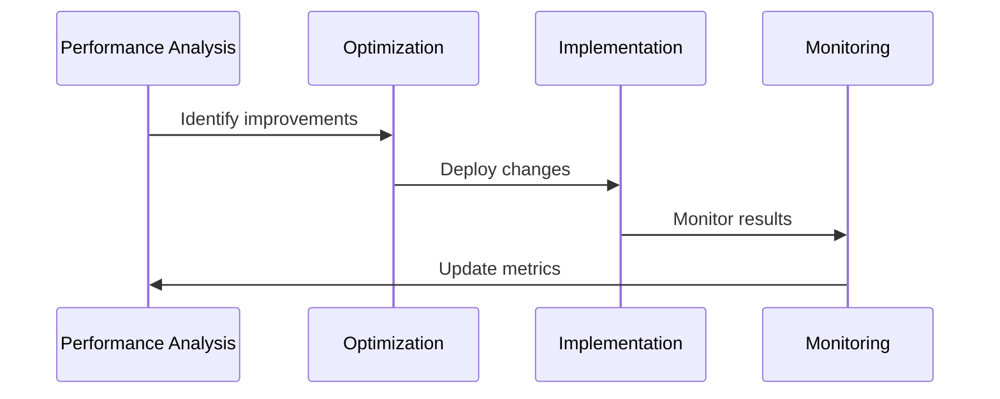

# Strategia utrzymania Overview

> [!TIP] Źródło tematu: Strategia utrzymania
> Kanoniczna definicja tematu "Strategia utrzymania" - dependency management, quality monitoring, automatyzacja.
> Wystąpienia: [technical.md](technical.md), [reference.md](reference.md)

## Concept

Strategia utrzymania w Next.js 15 Template opiera się na **proaktywnym podejściu** do utrzymania systemu, zapewniając długoterminową stabilność, bezpieczeństwo i wydajność projektu.

Maintenance Strategy to kompleksowy system zarządzania utrzymaniem projektu, który obejmuje automatyzację, monitoring i ciągłe doskonalenie. System ten zapewnia, że projekt pozostaje aktualny, bezpieczny i wydajny przez cały cykl życia.

## Problem

Projekty bez systematycznego podejścia do utrzymania napotykają wiele problemów:

- **Technical Debt** - Akumulacja długu technicznego prowadzi do spadku produktywności i wzrostu kosztów utrzymania
- **Deprecacje Dependencies** - Nieaktualne zależności stają się podatne na luki bezpieczeństwa i przestają być wspierane
- **Brak Monitoringu** - Brak wglądu w jakość kodu, wydajność i problemy prowadzi do reaktywnego podejścia
- **Brak Automatyzacji** - Ręczne procesy utrzymaniowe są podatne na błędy i nieefektywne
- **Reaktywne Naprawy** - Rozwiązywanie problemów po ich wystąpieniu jest droższe niż zapobieganie im
- **Brak Dokumentacji** - Nieaktualna lub niekompletna dokumentacja utrudnia długoterminowe utrzymanie

## Why?

Wprowadzenie Maintenance Strategy przynosi konkretne korzyści biznesowe i techniczne:

**Business Value:**
- **Niższe koszty utrzymania** - Proaktywne podejście jest tańsze niż reaktywne naprawy
- **Większa stabilność** - Systematyczne aktualizacje i monitoring zmniejszają ryzyko awarii
- **Bezpieczeństwo** - Regularne security patches i monitoring zapobiegają lukom bezpieczeństwa
- **Długoterminowa zrównoważoność** - Projekt pozostaje aktualny i łatwy w utrzymaniu przez lata

**Technical Benefits:**
- **Proactive Maintenance** - Zapobieganie problemom zamiast ich rozwiązywania
- **Systematic Approach** - Spójne i efektywne procesy utrzymaniowe
- **Continuous Monitoring** - Ciągłe monitorowanie jakości, wydajności i bezpieczeństwa
- **Automated Processes** - Automatyzacja eliminuje błędy ludzkie i przyspiesza workflow
- **Technical Debt Management** - Systematyczne zarządzanie długiem technicznym
- **Knowledge Management** - Zachowanie wiedzy i doświadczenia w dokumentacji

## Solution

Maintenance Strategy w Next.js 15 Template składa się z czterech głównych komponentów połączonych w spójną architekturę:

### Maintenance Architecture

### Maintenance Components

**1. Dependency Management**
- **Renovate** - Automatyczne aktualizacje zależności ([`renovate.json`](../../../renovate.json))
- **patch-package** - Zarządzanie patchami ([postinstall hook](../../../package.json))
- **npm audit** - Security scanning dependencies
- **s-update-manager** - Template propagation ([update-template script](../../../package.json))

**Szczegóły:** [`tech-dependency-management.md`](tech-dependency-management.md)

**2. Git Hooks & Quality Gates**
- **Husky** - Git hooks automation ([`.husky/`](../../../.husky/))
- **lint-staged** - Selective linting ([`.husky/lint-staged.config.json`](../../../.husky/lint-staged.config.json))
- **Quality Gates** - Progressive enforcement (pre-commit → pre-push)

**Szczegóły:** [`../9-code-quality/tech-husky.md`](../9-code-quality/tech-husky.md), [`../14-workflow/`](../14-workflow/)

**3. CI/CD Automation**
- **GitHub Actions** - Automatyczne testy i wdrażanie ([`.github/workflows/`](../../../.github/workflows/))
- **Semantic Release** - Automatyczne wersjonowanie ([`.releaserc.js`](../../../.releaserc.js))
- **Automated Testing** - CI/CD test pipeline

**Szczegóły:** [`../15-deployment/`](../15-deployment/)

**4. Documentation Core**
- **Memory Bank** - AI-powered documentation ([`memory-bank/`](../../../memory-bank/))
- **Cross-references** - Wystąpienia tracking (SSoT)
- **Domain Documentation** - Maintenance domain docs

**Szczegóły:** [`technical.md`](technical.md)

## Capabilities

Maintenance Strategy oferuje elastyczne możliwości adaptacji i rozbudowy:

### Maintenance Workflows

**1. Preventive Maintenance**
- Zaplanowane zadania utrzymaniowe
- Automatyczne aktualizacje i monitoring
- Proaktywne zapobieganie problemom

**2. Reactive Maintenance**
- Szybka reakcja na problemy
- Systematyczne rozwiązywanie issue'ów
- Weryfikacja i weryfikacja rozwiązań

**3. Continuous Improvement**
- Analiza i optymalizacja procesów
- Ewolucja narzędzi i workflow
- Ciągłe doskonalenie systemu

### Quality Monitoring Tools

System oferuje kompleksowe narzędzia monitorowania jakości:

- **Knip** - Unused code detection ([`quality:knip`](../../../package.json))
- **Madge** - Coupling analysis ([`quality:coupling:graph`](../../../package.json))
- **Bundle Analyzer** - Bundle size monitoring ([`build:analyze`](../../../package.json))
- **Test Coverage** - Coverage reports ([`quality:coverage`](../../../package.json))

**Szczegóły:** [`tech-monitoring.md`](tech-monitoring.md), [`../9-code-quality/`](../9-code-quality/)

### Rozbudowa i Adaptacja

Maintenance Strategy można rozbudować o:
- Performance monitoring w runtime
- Error tracking system
- Health checks endpoints
- Security monitoring w czasie rzeczywistym
- Advanced analytics i reporting

## Wystąpienia

- [`technical.md`](technical.md) — szczegóły implementacji i konfiguracji
- [`tech-dependency-management.md`](tech-dependency-management.md) — szczegóły zarządzania zależnościami
- [`tech-monitoring.md`](tech-monitoring.md) — quality monitoring tools
- [`../4-dependencies/`](../4-dependencies/) — kontekst w Dependency Management
- [`../9-code-quality/`](../9-code-quality/) — Git hooks i quality tools
- [`../11-performance/`](../11-performance/) — kontekst w Performance Strategy
- [`../13-security/`](../13-security/) — kontekst w Security Strategy
- [`../14-workflow/`](../14-workflow/) — kontekst w development workflow
- [`../15-deployment/`](../15-deployment/) — kontekst w deployment strategy
- [`memory-bank/progress.md`](../../../memory-bank/progress.md) — skrót maintenance dla AI
