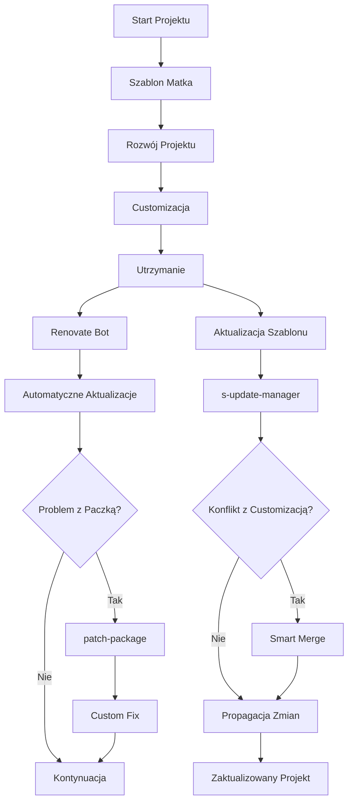

# Zarządzanie zależnościami Overview

> [!TIP] Źródło tematu: Zarządzanie zależnościami
> Kanoniczna definicja tematu "Zarządzanie zależnościami" - szablon matka, propagacja zmian, automatyczne aktualizacje.
> Wystąpienia: [technical.md](technical.md), [reference.md](reference.md), [tech-s-update-manager.md](tech-s-update-manager.md), [tech-renovate.md](tech-renovate.md), [tech-patch.md](tech-patch.md)

## Concept

System zarządzania zależnościami w Next.js 15 Template to **kompleksowe rozwiązanie dla długoterminowego utrzymania projektów** oparte na szablonie matce, automatycznych aktualizacjach i inteligentnych poprawkach.

## Problem

- **Rozproszone zmiany** - Każdy projekt ewoluuje niezależnie, brak synchronizacji
- **Duplikacja pracy** - Te same poprawki w każdym projekcie
- **Security debt** - Przestarzałe dependencies to luki bezpieczeństwa
- **Maintenance hell** - Ręczne aktualizacje w dziesiątkach projektów
- **Brak propagacji** - Ulepszenia w jednym projekcie nie trafiają do innych

## Why?

Dependency Management został wprowadzony, aby rozwiązać problemy związane z rozproszonymi zmianami, duplikacją pracy, security debt i maintenance hell w tradycyjnym podejściu do zarządzania zależnościami w wielu projektach.

## Solution

**Filozofia:** Jeden szablon matka, który ewoluuje i propaguje zmiany do wszystkich projektów, zachowując ich unikalne customizacje.

## Capabilities

### Architektura Systemu

## Komponenty Systemu

### 1. s-update-manager - Szablon Matka

**Dlaczego?** Potrzeba centralnego zarządzania i propagacji zmian

**Korzyści:**

- **Template Propagation** - Zmiany w szablonie matce trafiają do wszystkich projektów
- **Smart Merge** - Inteligentne łączenie zmian z customizacjami projektu
- **Conflict Resolution** - Automatyczne rozwiązywanie konfliktów
- **Version Tracking** - Śledzenie wersji szablonu w każdym projekcie

### 2. Renovate Bot - Automatyczne Aktualizacje

**Dlaczego?** Ręczne monitorowanie dependencies w dziesiątkach projektów jest niemożliwe

**Korzyści:**

- **Mass Updates** - Aktualizacje dependencies we wszystkich projektach jednocześnie
- **Security First** - Priorytet dla aktualizacji bezpieczeństwa
- **Dependency Grouping** - Inteligentne grupowanie powiązanych aktualizacji
- **Automated PRs** - Automatyczne pull requesty z testami

### 3. patch-package - Inteligentne Poprawki

**Dlaczego?** Niektóre dependencies wymagają niestandardowych poprawek

**Korzyści:**

- **Custom Fixes** - Możliwość naprawy błędów w dependencies
- **Template Integration** - Patche mogą być częścią szablonu matki
- **Team Consistency** - Identyczne poprawki dla całego zespołu
- **CI/CD Integration** - Automatyczne aplikowanie patchy

## Wartość Biznesowa

### Długoterminowe Korzyści

- **Redukcja kosztów** - 80% mniej czasu na maintenance
- **Bezpieczeństwo** - Automatyczne security updates
- **Skalowalność** - Łatwe zarządzanie dziesiątkami projektów
- **Jakość** - Spójne standardy we wszystkich projektach
- **Innowacja** - Szybka propagacja nowych rozwiązań

### ROI Dependency Management

- **Setup Time:** 2-3 dni vs. tygodnie ręcznej pracy
- **Maintenance:** 2h/miesiąc vs. 2 dni/miesiąc
- **Security:** 0-dniowe okno podatności vs. tygodnie
- **Consistency:** 100% spójność vs. chaos w projektach

## Occurrences

- [`technical.md`](technical.md) — synergia między narzędziami, przepływ pracy
- [`reference.md`](reference.md) — quick reference i statusy narzędzi
- [`tech-s-update-manager.md`](tech-s-update-manager.md) — szczegóły s-update-manager
- [`tech-renovate.md`](tech-renovate.md) — szczegóły Renovate Bot
- [`tech-patch.md`](tech-patch.md) — szczegóły patch-package
- [`../16-maintenance/`](../16-maintenance/) — długoterminowe utrzymanie
- [`memory-bank/techContext.md`](../../../memory-bank/techContext.md) — kontekst dla AI
