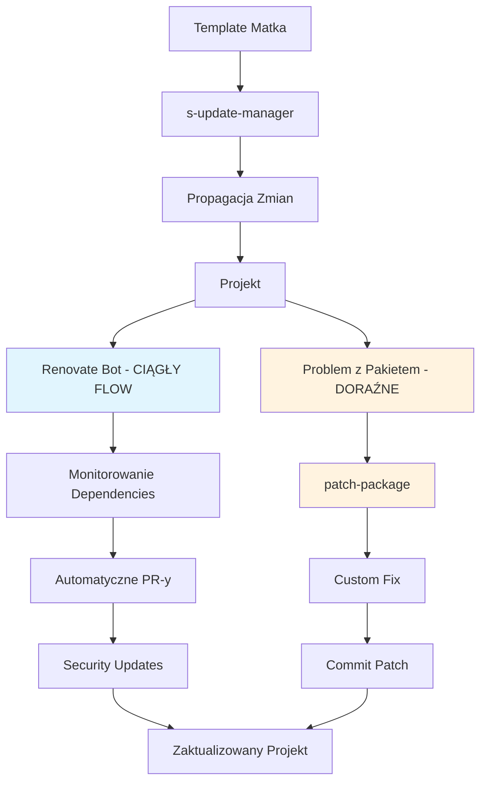

# Przewodnik techniczny zarządzania zależnościami

> [!NOTE] Wystąpienie tematu
> Synergia narzędzi dependency management - jak współpracują ze sobą.
> Źródło koncepcji: [overview.md](overview.md)
> Szczegóły narzędzi: [tech-s-update-manager.md](tech-s-update-manager.md), [tech-renovate.md](tech-renovate.md), [tech-patch.md](tech-patch.md)

## Quick Start Status

> [!NOTE] Wystąpienie tematu: Dependency Setup
> Zarządzanie dependencies w kontekście setupu projektu.
> Źródło: [1-getting-started/technical.md#installation](../1-getting-started/technical.md#installation)

### Co Działa Od Razu ✅

| Narzędzie            | Status        | Komenda                |
| -------------------- | ------------- | ---------------------- |
| **s-update-manager** | ✅ **GOTOWE** | `yarn update-template` |

### Co Wymaga Konfiguracji ⚠️

| Narzędzie         | Status                  | Co Trzeba Zrobić                                |
| ----------------- | ----------------------- | ----------------------------------------------- |
| **Renovate Bot**  | ⚠️ **WYMAGA WŁĄCZENIA** | Usuń `"enabled": false` z renovate.json         |
| **patch-package** | ✅ **GOTOWE**           | `postinstall` już skonfigurowany w package.json |

## Synergia Dependency Management

System dependency management to **orkiestra trzech narzędzi** działających w harmonii:



## 1. Template Propagation Flow

### s-update-manager jako Centralny Hub

**ROLA:** Propaguje zmiany z szablonu matki do wszystkich projektów

**WORKFLOW:**

```bash
# 1. Sprawdź dostępne aktualizacje
yarn update-template --dry-run

# 2. Wykonaj aktualizację
yarn update-template

# 3. Rozwiąż konflikty z customizacjami
git diff
# Edytuj pliki z konfliktami

# 4. Test i commit
yarn test
git commit -m "chore: update template"
```

**INTEGRACJA Z INNYMI NARZĘDZIAMI:**

- **Renovate:** Aktualizuje dependencies w szablonie matki
- **patch-package:** Patche mogą być częścią szablonu

**Więcej:** [tech-s-update-manager.md](tech-s-update-manager.md)

## 2. Ciągły Flow Updates

### Renovate Bot jako Ciągły Monitor

**ROLA:** Non-stop monitoring i aktualizacja dependencies

**STATUS:** 🔄 **CIĄGŁY FLOW (wyłączony)** - działa non-stop gdy włączony

**WORKFLOW (gdy włączony):**

```bash
# 1. Renovate skanuje package.json CONTINUOUSLY
# 2. Tworzy PR-y z aktualizacjami AUTOMATYCZNIE
# 3. Grupuje major/minor/patch INTELIGENTNIE
# 4. Priorytet dla security alerts NATYCHMIASTOWO
# 5. Automatyczny merge po testach BEZ INTERWENCJI
```

**CHARAKTERYSTYKA CIĄGŁEGO FLOW:**

- **FREKWENCJA:** Codziennie/tygodniowo
- **AUTOMATYZACJA:** 100% - zero manual work
- **MONITORING:** 24/7 dependencies
- **REAKCJA:** Natychmiastowa na security alerts

**INTEGRACJA Z INNYMI NARZĘDZIAMI:**

- **s-update-manager:** Aktualizuje dependencies w szablonie matki
- **patch-package:** Może wykryć potrzebę patchy

**Więcej:** [tech-renovate.md](tech-renovate.md)

## 3. Doraźne Rozwiązania

### patch-package jako Emergency Tool

**ROLA:** Naprawia problematyczne dependencies tylko gdy jest problem

**STATUS:** ✅ **GOTOWE (nieużywany)** - tylko w razie potrzeby

**WORKFLOW (gdy potrzebny):**

```bash
# 1. Zidentyfikuj problem z dependency
yarn test  # błąd w dependency

# 2. Napraw w node_modules
# Edytuj: node_modules/problematic-package/lib/index.js

# 3. Stwórz patch
npx patch-package package-name

# 4. Commit patch
git add patches/
git commit -m "fix: patch package-name"

# 5. Patch aplikuje się automatycznie przy npm install
```

**CHARAKTERYSTYKA DORAŹNEGO DZIAŁANIA:**

- **FREKWENCJA:** Rzadko, tylko gdy problem
- **AUTOMATYZACJA:** Manualna - wymaga interwencji
- **MONITORING:** Brak - reaktywne działanie
- **REAKCJA:** Tylko gdy coś się zepsuje

**INTEGRACJA Z INNYMI NARZĘDZIAMI:**

- **s-update-manager:** Patche mogą być częścią szablonu
- **Renovate:** Może wykryć potrzebę patchy

**Więcej:** [tech-patch.md](tech-patch.md)

## Workflow Synergii

### Scenariusz 1: Normalna Aktualizacja

```bash
# 1. s-update-manager propaguje zmiany z szablonu
yarn update-template

# 2. Sprawdź czy wszystko działa
yarn test
yarn build

# 3. Commit zmian
git commit -m "chore: update template"
```

### Scenariusz 2: Problem z Dependency

```bash
# 1. Zidentyfikuj problem
yarn test  # błąd w dependency

# 2. Napraw w node_modules
# Edytuj: node_modules/problematic-package/lib/index.js

# 3. Stwórz patch
npx patch-package problematic-package

# 4. Commit patch
git add patches/
git commit -m "fix: patch problematic-package"

# 5. Test
yarn test  # powinno działać
```

### Scenariusz 3: Security Update (gdy włączysz Renovate)

```bash
# 1. Renovate wykrywa vulnerability
# 2. Tworzy PR z security update
# 3. Review i merge PR
# 4. Test po aktualizacji
yarn test

# 5. Jeśli problem - użyj patch-package
npx patch-package updated-package
```

## Konfiguracja Synergii

### Package.json Scripts

**Aktualne skrypty:**

```bash
yarn update-template         # s-update-manager ✅
yarn update-template:build   # s-update-manager ✅
# postinstall: patch-package  # ✅ Już skonfigurowany
```

**Szczegóły:** Zobacz [package.json](../../../package.json)

### Status Check

```bash
# Sprawdź status wszystkich narzędzi
yarn update-template --dry-run          # s-update-manager
npx renovate-config-validator renovate.json  # Renovate
npx patch-package --check               # patch-package (gdy używany)
```

## Troubleshooting Synergii

### Problem: Konflikt po template update

```bash
# 1. Sprawdź konflikty
git status
git diff

# 2. Rozwiąż konflikty ręcznie
# Edytuj pliki z konfliktami

# 3. Test
yarn test
yarn build

# 4. Jeśli problem z dependency - użyj patch
npx patch-package problematic-package
```

### Problem: Patch nie działa po update

```bash
# 1. Sprawdź czy patch się aplikuje
npx patch-package --check

# 2. Jeśli nie - odtwórz patch
npx patch-package --reverse
# Napraw ponownie w node_modules
npx patch-package package-name
```

## Wystąpienia

- [`overview.md`](overview.md) — koncepcja i filozofia dependency management
- [`reference.md`](reference.md) — quick reference i statusy
- [`tech-s-update-manager.md`](tech-s-update-manager.md) — szczegóły s-update-manager
- [`tech-renovate.md`](tech-renovate.md) — szczegóły Renovate Bot
- [`tech-patch.md`](tech-patch.md) — szczegóły patch-package
- [`../16-maintenance/`](../16-maintenance/) — długoterminowe utrzymanie
- [`package.json`](../../../package.json) — dependencies i skrypty
- [`renovate.json`](../../../renovate.json) — konfiguracja Renovate
- [`.sum.config.json`](../../../.sum.config.json) — konfiguracja s-update-manager
