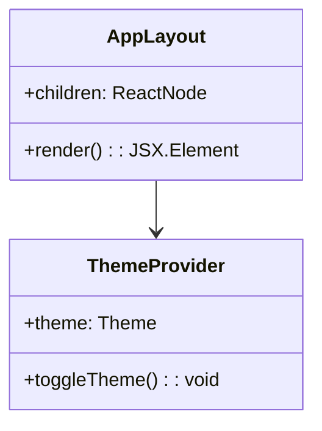
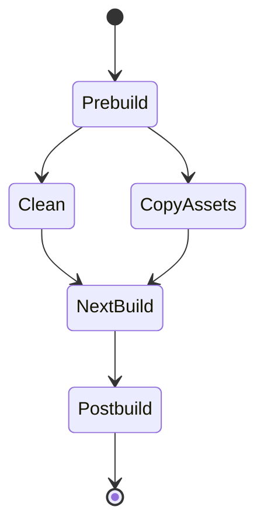
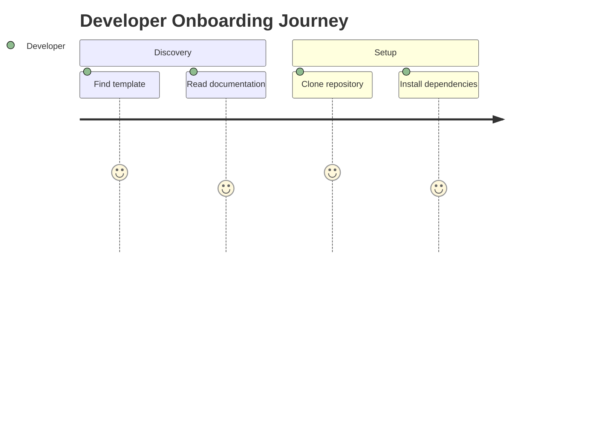
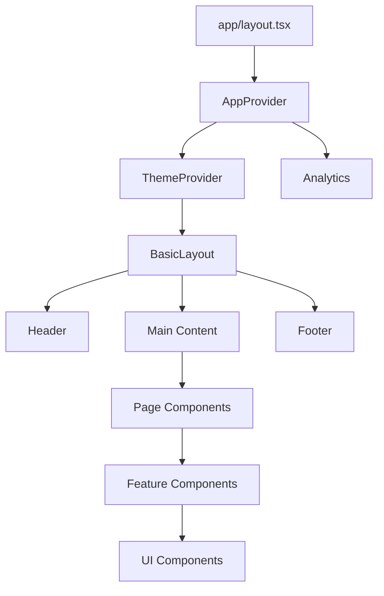
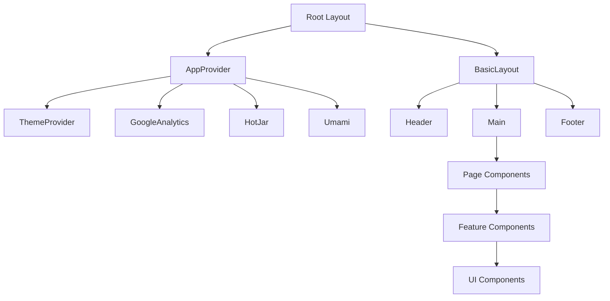
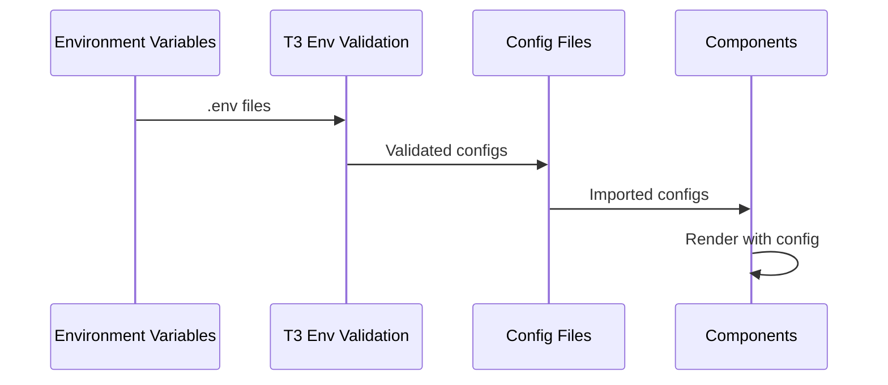
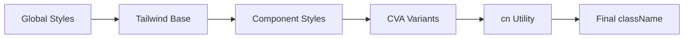
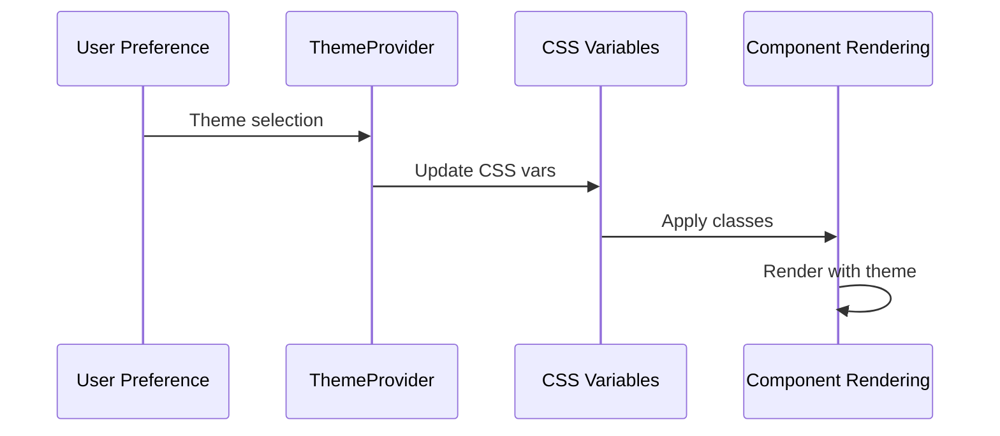

# Mermaid Diagrams - Architecture & Context Mapping

## Context Mapping Table

| Jeśli dokumentujesz... | Użyj diagramu...      | Przykład zastosowania                 |
| ---------------------- | --------------------- | ------------------------------------- |
| Architektura systemu   | C4/Block Diagram      | `systemPatterns.md` - system overview |
| Przepływ danych        | Flowchart/Sequence    | `techContext.md` - build process      |
| Cykl życia             | State Diagram         | `progress.md` - project phases        |
| Harmonogram            | Gantt/Timeline        | `activeContext.md` - current sprint   |
| Struktura klas         | Class Diagram         | `systemPatterns.md` - components      |
| Relacje encji          | ER Diagram            | `techContext.md` - config schema      |
| Strategia Git          | Git Graph             | `docs/LinearGitHubWorkflow.md`        |
| User flow              | User Journey/Sequence | `productContext.md` - user experience |
| Planowanie             | Mindmap               | `projectbrief.md` - feature planning  |
| Metryki                | Pie Chart             | `progress.md` - project statistics    |
| Interakcje API         | Sequence Diagram      | `techContext.md` - API interactions   |
| Kontekst biznesowy     | C4 Context            | `productContext.md` - user context    |
| Roadmapa               | Timeline              | `activeContext.md` - recent changes   |

## Memory Bank Patterns

### systemPatterns.md

**Główne typy diagramów:**

- **Class Diagrams** - component architecture
- **Block Diagrams** - technology stack
- **C4 Diagrams** - system context
- **Flowcharts** - data flow

**Przykłady użycia:**

### techContext.md

**Główne typy diagramów:**

- **Block Diagrams** - build process
- **State Diagrams** - deployment states
- **Sequence Diagrams** - API interactions
- **ER Diagrams** - configuration schema

**Przykłady użycia:**

### productContext.md

**Główne typy diagramów:**

- **User Journey** - user experience
- **Sequence Diagrams** - user interactions
- **Flowcharts** - business processes
- **Timeline** - feature evolution

**Przykłady użycia:**

### progress.md

**Główne typy diagramów:**

- **Gantt Charts** - project timeline
- **Timeline** - milestone history
- **Pie Charts** - metrics breakdown
- **State Diagrams** - project phases

### activeContext.md

**Główne typy diagramów:**

- **Flowcharts** - current workflow
- **State Diagrams** - work states
- **Gantt Charts** - current sprint
- **Mindmaps** - planning sessions

## Documentation Patterns

### README.md

**Rekomendowane diagramy:**

- **Block Diagram** - quick architecture overview
- **Flowchart** - installation process
- **User Journey** - getting started
- **Timeline** - project status

### docs/technical/

**Rekomendowane diagramy:**

- **Class Diagrams** - API structure
- **Sequence Diagrams** - integration patterns
- **ER Diagrams** - data models
- **State Diagrams** - system states

### docs/guides/

**Rekomendowane diagramy:**

- **Flowcharts** - step-by-step processes
- **User Journey** - tutorial flows
- **Sequence Diagrams** - interaction patterns
- **Timeline** - learning path

### docs/architecture/

**Rekomendowane diagramy:**

- **C4 Diagrams** - system architecture
- **Block Diagrams** - component overview
- **Class Diagrams** - detailed structure
- **Git Graph** - development workflow

## Component Relationships

### Dependency Flow

### Component Hierarchy

## Integration Patterns

### Configuration Flow

### Styling Flow

### Theme Flow

## Architecture Decision Records

### Kiedy używać Class Diagrams

- **Component architecture** - pokazanie zależności między komponentami React
- **Service layer** - struktura serwisów i ich interakcji
- **Data models** - relacje między typami danych

### Kiedy używać Sequence Diagrams

- **API interactions** - przepływ żądań między klientem a serwerem
- **User workflows** - interakcje użytkownika z systemem
- **Integration patterns** - komunikacja między mikroserwisami

### Kiedy używać State Diagrams

- **Component lifecycle** - stany komponentów React
- **Build process** - etapy budowania aplikacji
- **Feature development** - fazy rozwoju funkcjonalności

### Kiedy używać C4 Diagrams

- **System context** - kto używa systemu i jak
- **Container architecture** - główne komponenty systemu
- **Component relationships** - szczegółowe zależności

## Best Practices dla Memory Bank

### 1. Consistency

- Używaj spójnych nazw w diagramach
- Zachowaj ten sam styl wizualny
- Aktualizuj diagramy razem z kodem

### 2. Clarity

- Każdy diagram powinien mieć jasny tytuł
- Używaj komentarzy dla wyjaśnienia
- Grupuj powiązane elementy

### 3. Maintenance

- Regularnie sprawdzaj aktualność diagramów
- Usuwaj przestarzałe diagramy
- Dokumentuj zmiany w diagramach

### 4. Integration

- Diagramy powinny wspierać tekst
- Nie duplikuj informacji z kodu
- Używaj diagramów do wyjaśnienia złożonych konceptów
