# Mermaid Diagrams - Quick Start (Full-Stack)

## 1. Graph (Flowchart) – Podstawowy przepływ

**Kiedy używać:**
Używaj do przedstawienia prostego przepływu danych lub komunikacji między elementami systemu — np. pokazania, jak klient wysyła żądanie do API, a to komunikuje się z bazą danych. Idealny do szybkiego szkicowania architektury wysokiego poziomu w projektach Full-Stack.

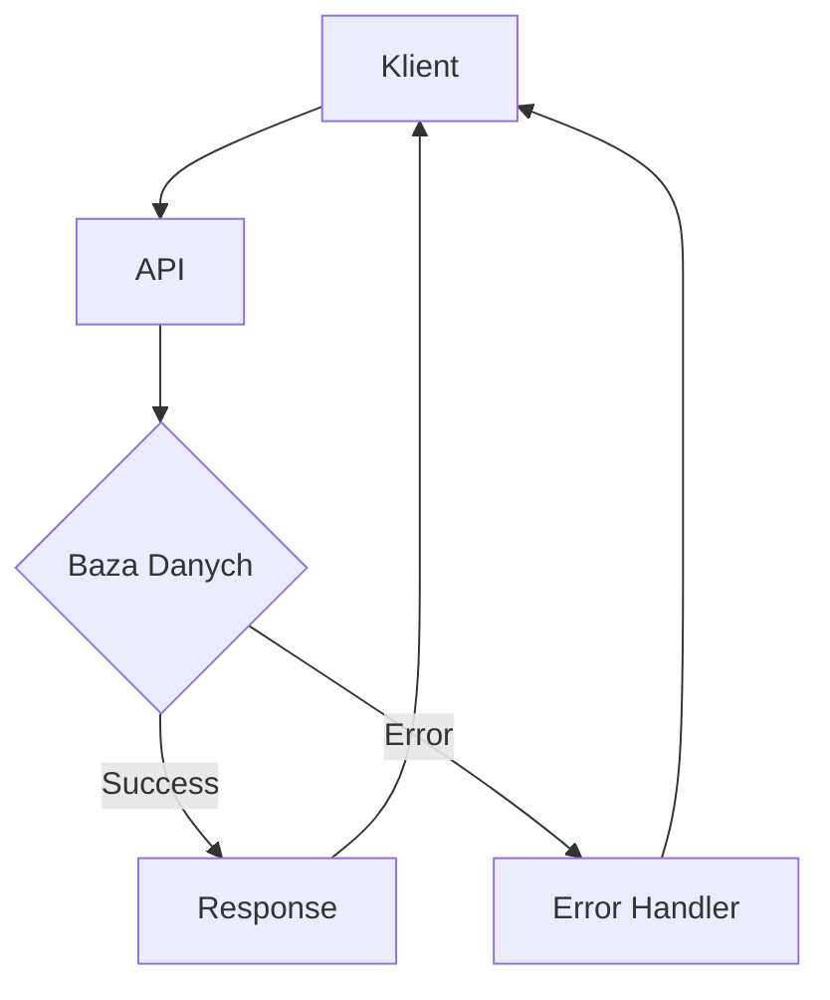

---

## 2. Sequence Diagram – Sekwencja logowania

**Kiedy używać:**
Stosuj, gdy istotna jest kolejność interakcji między usługami lub komponentami — np. proces logowania, płatności czy komunikacja mikroserwisów. Doskonały do obrazowania przepływu żądań w czasie w architekturze Full-Stack.

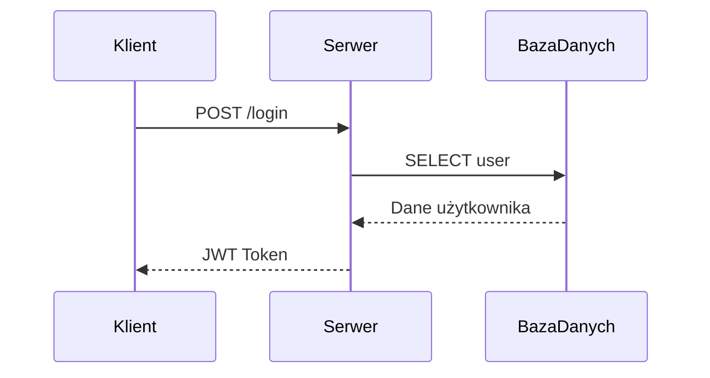

---

## 3. ER Diagram – Relacje w bazie danych

**Kiedy używać:**
Używaj do projektowania i omawiania struktury relacyjnej bazy danych — np. tabele użytkowników i postów. Pomaga w wizualizacji relacji 1-N, N-M i kluczy obcych w projektach Full-Stack z bazami SQL.

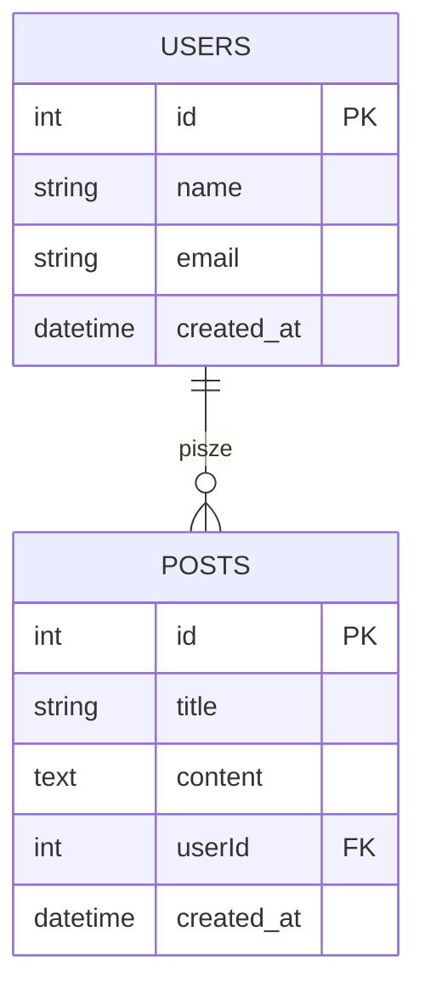

---

## 4. Class Diagram – Struktura klas w NestJS

**Kiedy używać:**
Stosuj do pokazania struktury i zależności między klasami lub modułami w aplikacjach typu NestJS / OOP. Pozwala zobaczyć powiązania między kontrolerami, serwisami i modelami domenowymi.

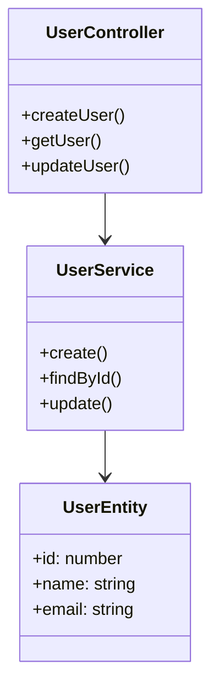

---

## 5. State Diagram – Cykl życia zamówienia

**Kiedy używać:**
Idealny do przedstawienia, jak obiekty lub procesy zmieniają stany w czasie — np. cykl życia zamówienia od szkicu do zakończenia. Przydatny w logice biznesowej systemów e-commerce.

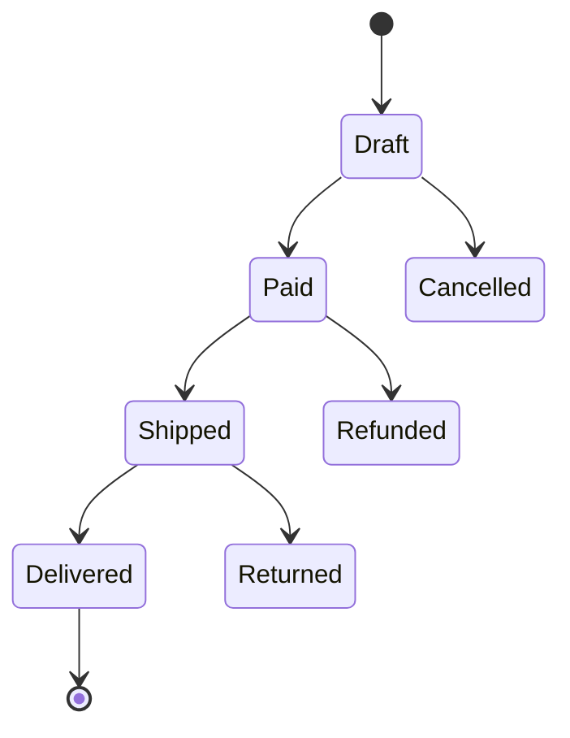

---

## 6. Gantt Chart – Harmonogram sprintu

**Kiedy używać:**
Używaj do planowania zadań w czasie, pokazywania harmonogramu sprintów i zależności między etapami projektu Full-Stack. Doskonały do wizualizacji roadmapy zespołu developerskiego.

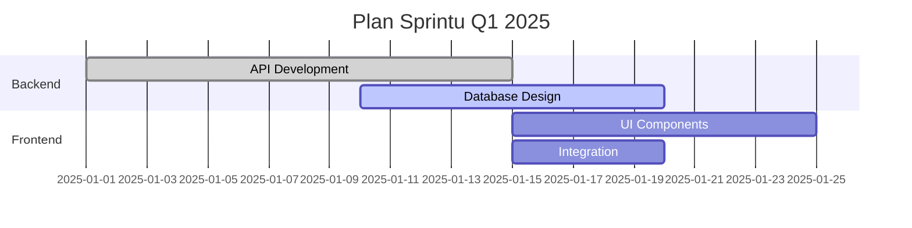

---

## 7. Pie Chart – Wykres przychodów SaaS

**Kiedy używać:**
Do pokazania procentowego udziału elementów w całości — np. struktury przychodów, podziału planów abonamentowych czy udziału użytkowników w planach. Idealny do dashboardów analitycznych.

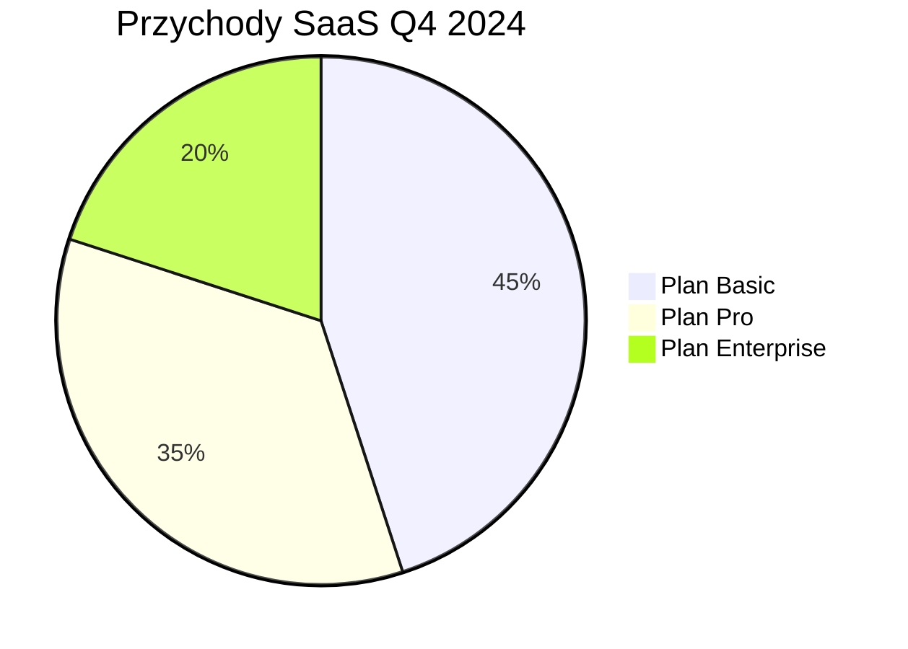

---

## 8. Mindmap – Struktura funkcjonalności

**Kiedy używać:**
Stosuj do planowania funkcji, burzy mózgów i rozbijania epików na mniejsze zadania. Ułatwia wizualizację hierarchii funkcjonalności lub modułów w aplikacji.

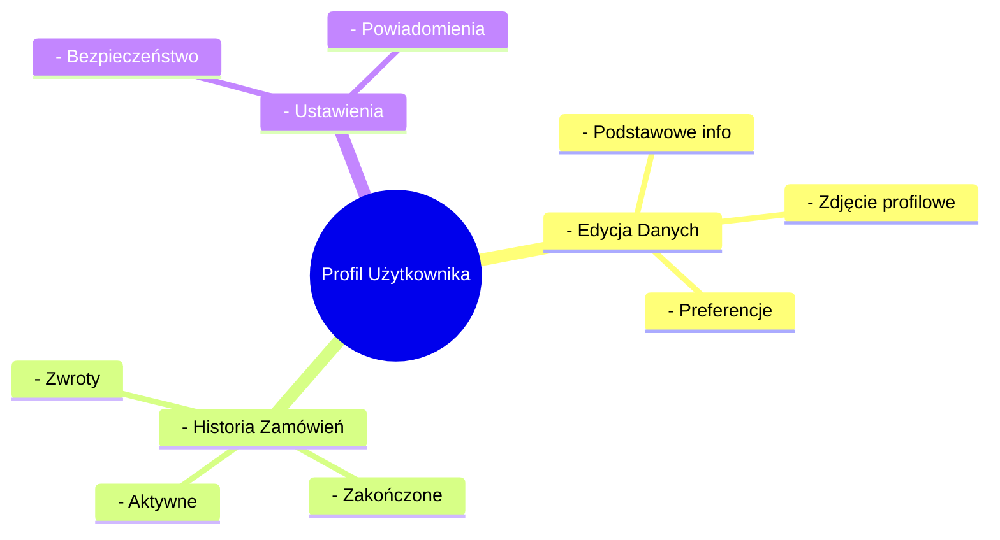

---

## 9. C4 Diagram – Kontekst systemu

**Kiedy używać:**
Do formalnego, wielopoziomowego dokumentowania architektury — od kontekstu po komponenty. Szczególnie przydatny w dużych systemach Full-Stack, by jasno pokazać, kto i jak korzysta z aplikacji.

```mermaid
c4Context
    title System Context for E-commerce Platform
    Person(customer, "Klient", "Kupuje produkty online")
    Person(admin, "Administrator", "Zarządza sklepem")
    System(ecommerce, "Platforma E-commerce", "Sklep internetowy z API")
    System_Ext(payment, "System Płatności", "Przetwarzanie płatności")
    System_Ext(warehouse, "Magazyn", "Zarządzanie zapasami")

    customer -- "Kupuje" --> ecommerce
    admin -- "Zarządza" --> ecommerce
    ecommerce -- "Przetwarza płatności" --> payment
    ecommerce -- "Sprawdza dostępność" --> warehouse
```

---

## 10. Block Diagram – Architektura wysokiego poziomu

**Kiedy używać:**
Użyteczny do przedstawienia nowoczesnej architektury systemowej — np. przepływu między klientem, serwerem i bazą w architekturze mikroserwisowej lub chmurowej.

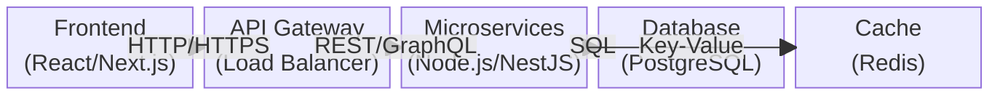

---

## 11. Git Graph – Historia repozytorium

**Kiedy używać:**
Do wizualizacji historii Git — branchy, merge'y i strategii rozwoju (np. Git Flow). Pomaga w edukacji nowych członków zespołu i dokumentacji procesu CI/CD.

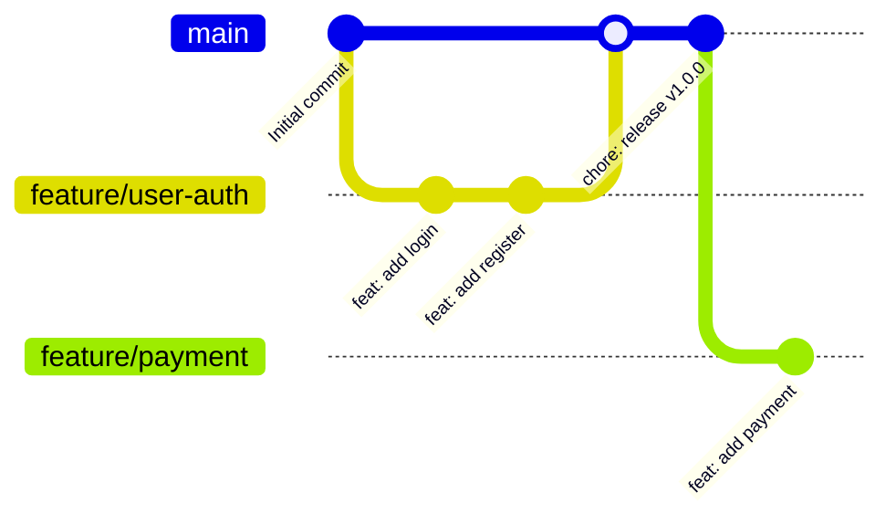

---

## 12. User Journey – Podróż użytkownika

**Kiedy używać:**
Do mapowania całej ścieżki użytkownika — od rejestracji po zakup. Świetny do UX-owego spojrzenia na produkt Full-Stack i planowania punktów styku użytkownika z systemem.

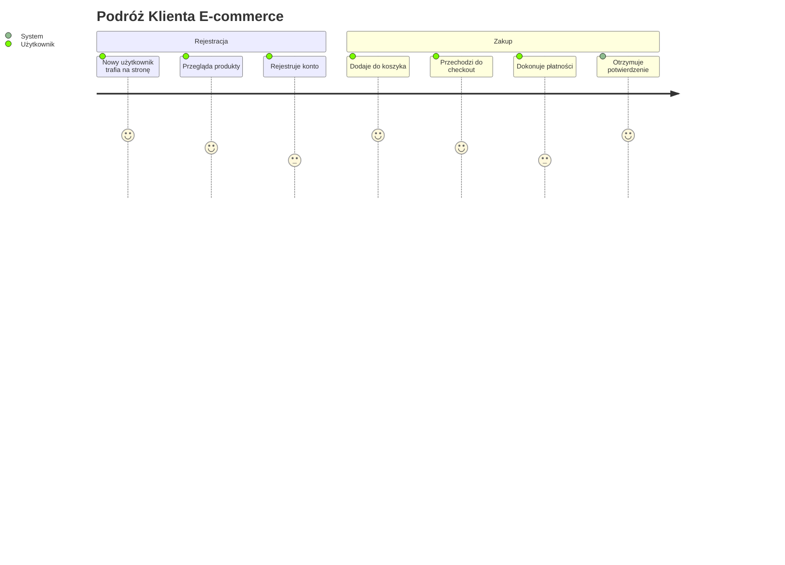

---

## 13. Timeline – Oś czasu projektu

**Kiedy używać:**
Do przedstawienia chronologii zdarzeń — np. roadmapy produktu, etapów wdrożenia czy historii aktualizacji. Pozwala łatwo komunikować postęp projektu Full-Stack.

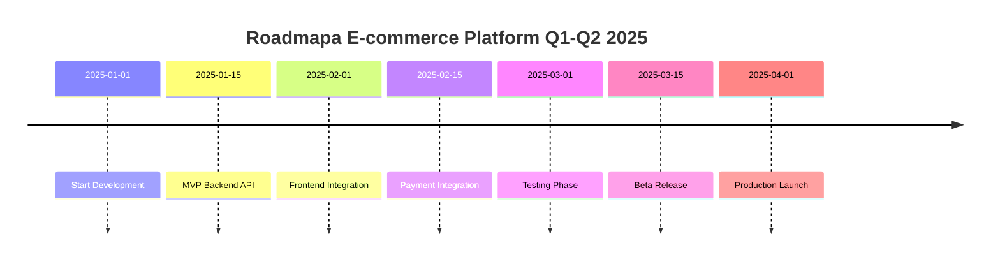

---

## Szybki wybór diagramu

| Chcesz pokazać...   | Użyj diagramu... | Przykład              |
| ------------------- | ---------------- | --------------------- |
| Przepływ danych     | Graph/Flowchart  | Klient → API → DB     |
| Interakcje w czasie | Sequence Diagram | Logowanie użytkownika |
| Strukturę bazy      | ER Diagram       | Tabele users/posts    |
| Architekturę klas   | Class Diagram    | NestJS controllers    |
| Zmiany stanów       | State Diagram    | Cykl życia zamówienia |
| Harmonogram         | Gantt Chart      | Plan sprintu          |
| Procenty/udziały    | Pie Chart        | Przychody SaaS        |
| Planowanie          | Mindmap          | Struktura funkcji     |
| Kontekst systemu    | C4 Diagram       | E-commerce platform   |
| Architekturę        | Block Diagram    | Mikroserwisy          |
| Historię Git        | Git Graph        | Branch strategy       |
| UX flow             | User Journey     | Podróż klienta        |
| Chronologię         | Timeline         | Roadmapa projektu     |
