# Mermaid Diagrams - Templates & Examples

## Templates & Snippets

### Component Architecture Template

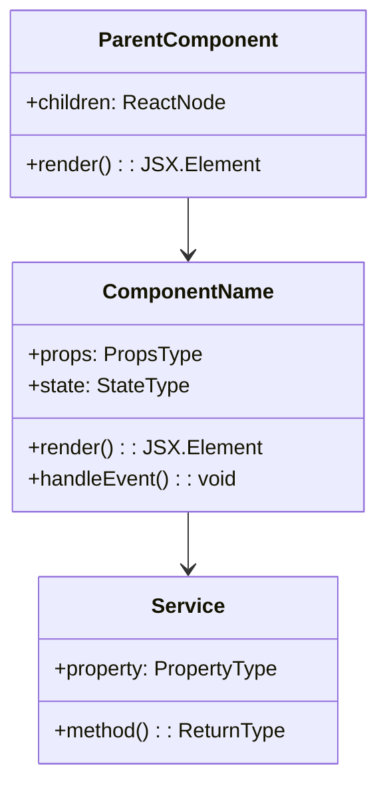

### Build Process Template

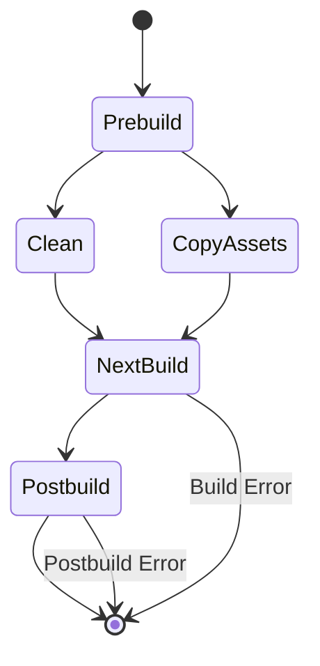

### API Interaction Template

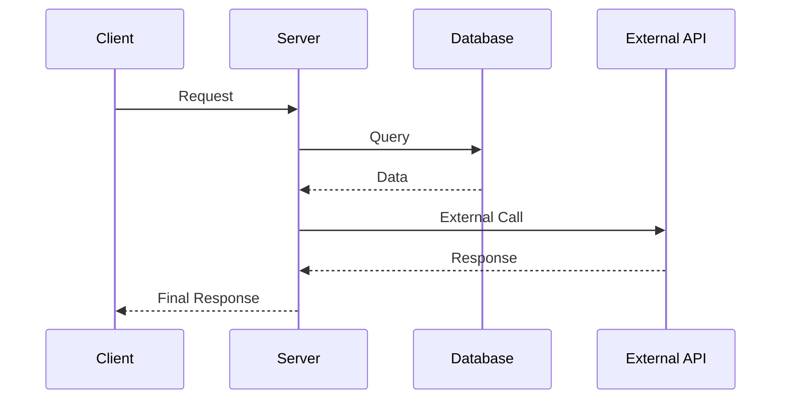

### Project Timeline Template

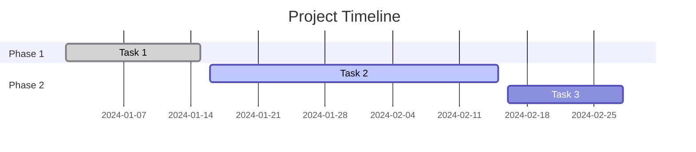

## Real Project Examples

### Example 1: Git Workflow (docs/LinearGitHubWorkflow.md)

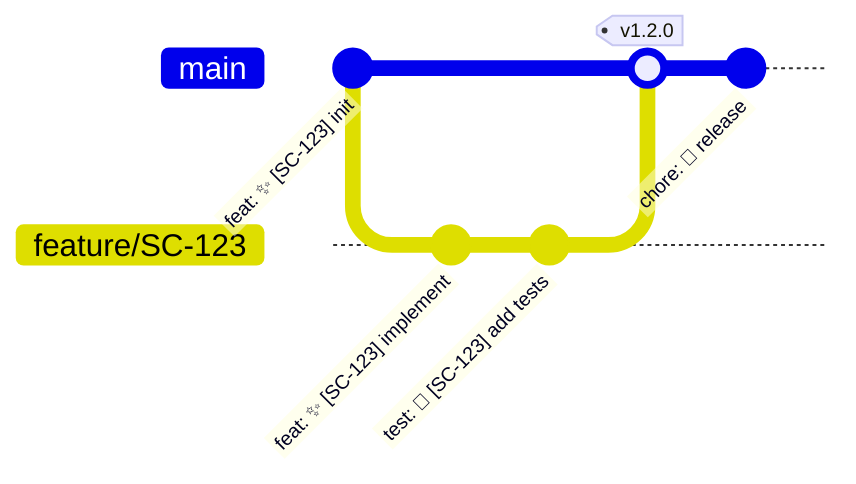

### Example 2: Build Process (techContext.md)

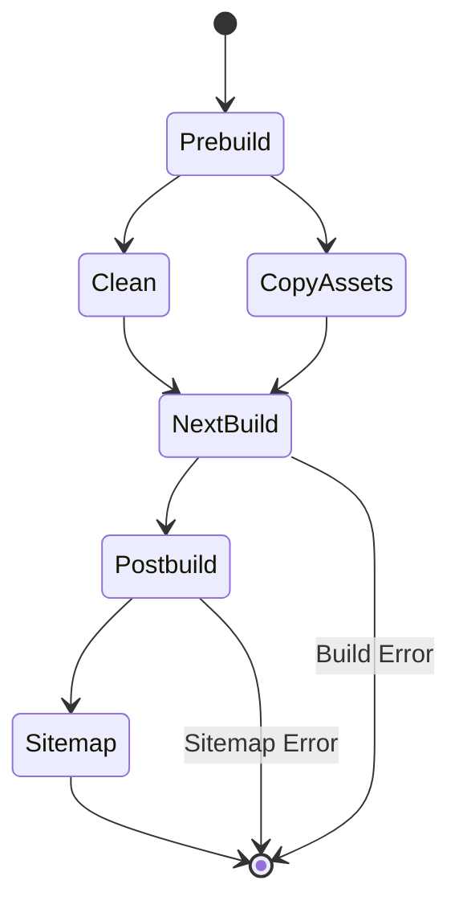

### Example 3: Component Architecture (systemPatterns.md)

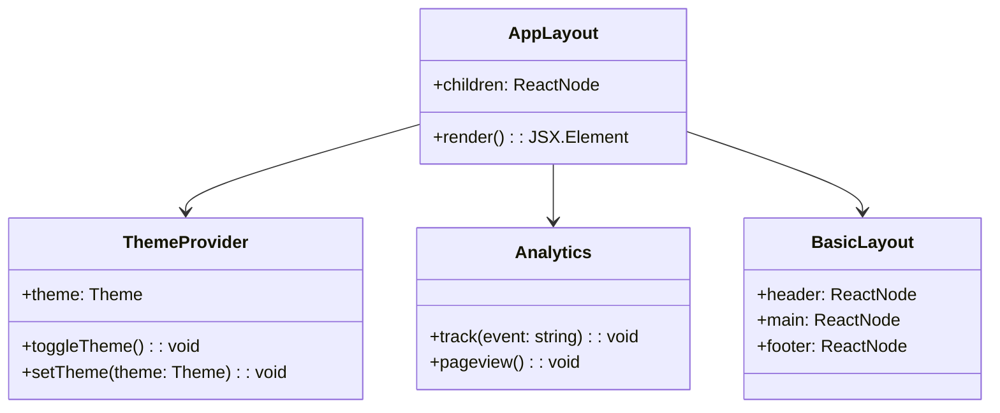

### Example 4: User Journey (productContext.md)

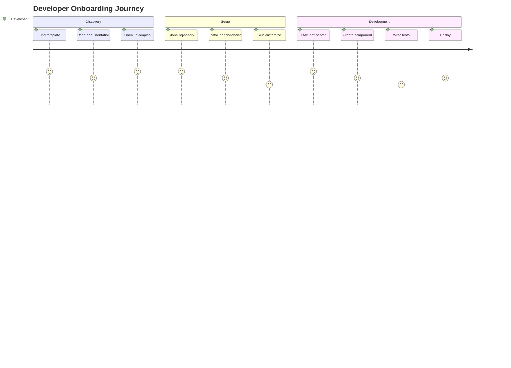

### Example 5: Technology Stack (techContext.md)

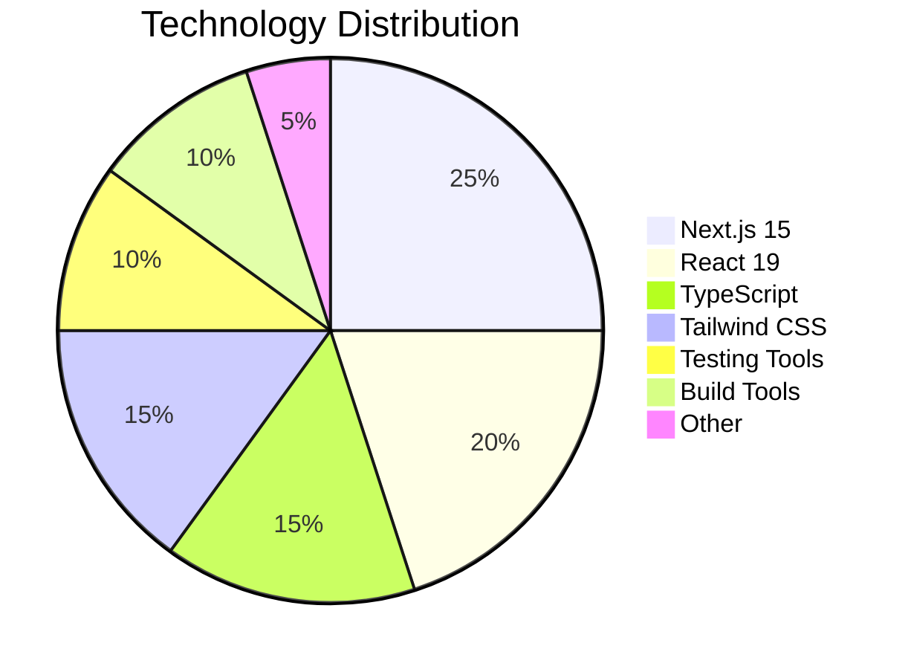

## Copy-Paste Ready Snippets

### Quick Flowchart

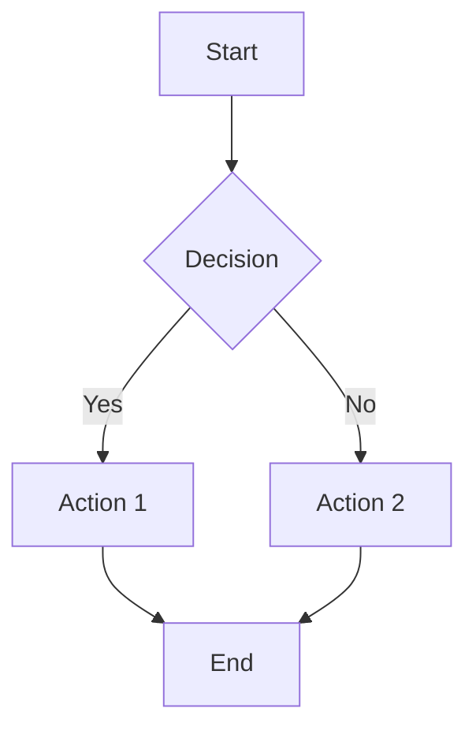

### Quick Sequence

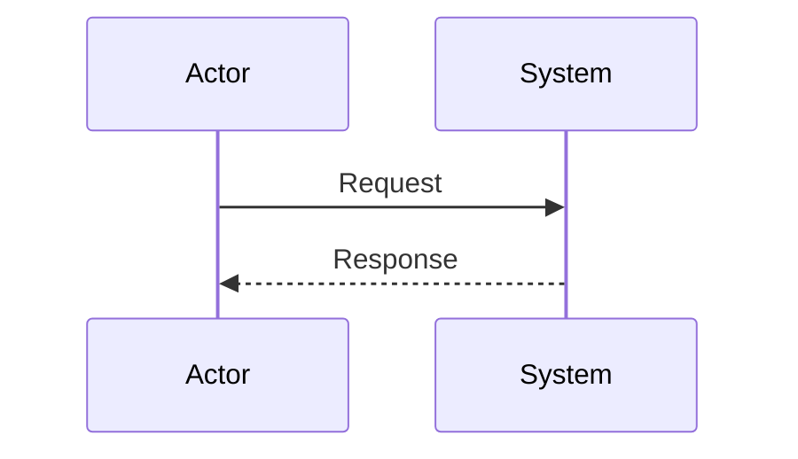

### Quick ER Diagram

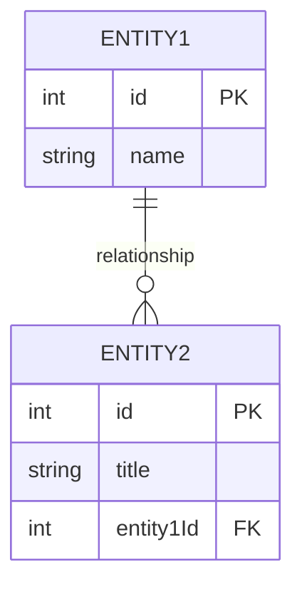

### Quick State Diagram

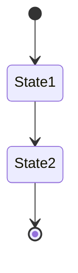

### Quick Gantt Chart

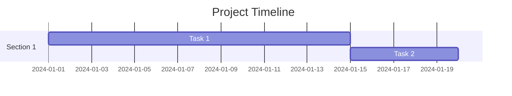

### Quick Pie Chart

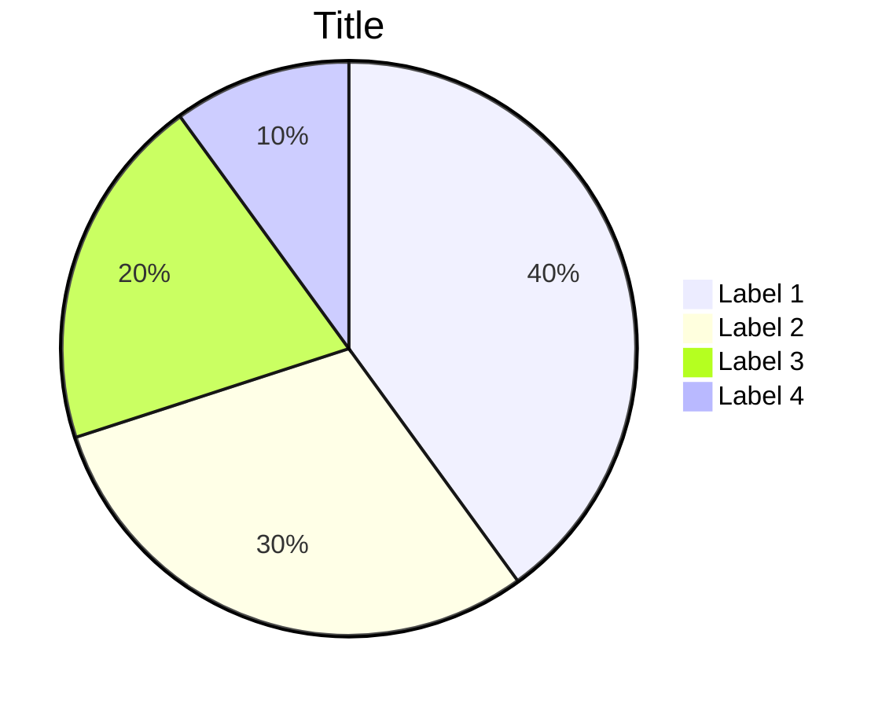

### Quick Mindmap

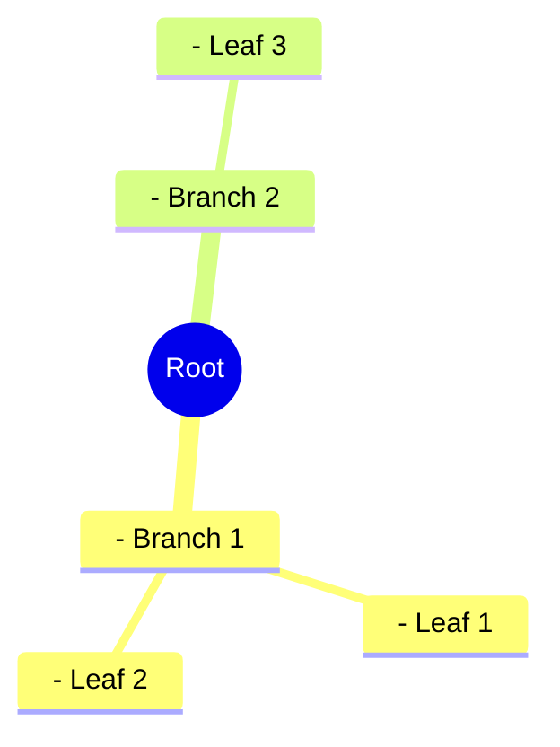

### Quick C4 Context

```mermaid
c4Context
    title System Context
    Person(user, "User", "Uses the system")
    System(system, "System", "Main system")
    user -- "Uses" --> system
```

### Quick Block Diagram

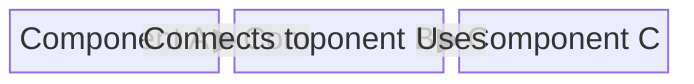

### Quick Git Graph

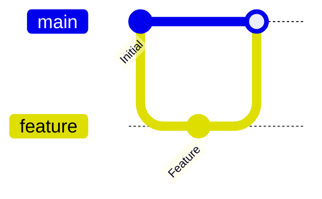

### Quick User Journey

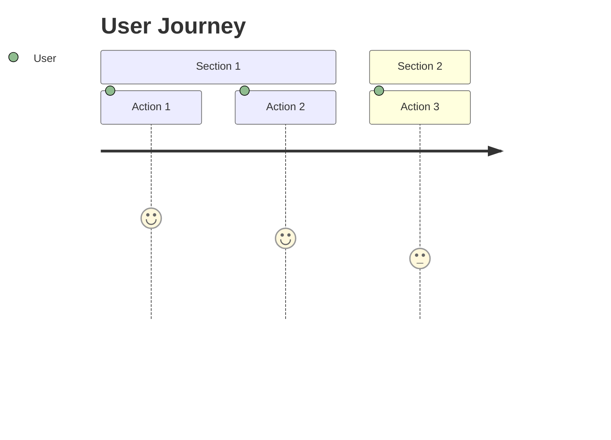

### Quick Timeline

```mermaid
timeline
    title Timeline
    2024-01-01 : Event 1
    2024-02-01 : Event 2
    2024-03-01 : Event 3
```

## Customization Tips

### 1. Styling

- Używaj `%%{init: {'theme':'dark'}}%%` dla dark theme
- Dodaj `%%{init: {'themeVariables': {'primaryColor': '#ff0000'}}}%%` dla custom colors

### 2. Layout

- `graph TD` - top down
- `graph LR` - left right
- `graph TB` - top bottom
- `graph BT` - bottom top

### 3. Shapes

- `[Rectangle]` - prostokąt
- `(Round)` - okrągły
- `{Diamond}` - diament
- `((Circle))` - koło

### 4. Arrows

- `-->` - strzałka
- `-.->` - przerywana
- `==>` - gruba
- `--o` - z kółkiem
- `--x` - z X

### 5. Labels

- `A -->|label| B` - etykieta na strzałce
- `A --> B : label` - etykieta po dwukropku

## Common Patterns

### Decision Tree

```mermaid
flowchart TD
    A[Start] --> B{Question?}
    B -->|Yes| C[Path A]
    B -->|No| D[Path B]
    C --> E[End A]
    D --> F[End B]
```

### Process Flow

```mermaid
flowchart LR
    A[Step 1] --> B[Step 2]
    B --> C[Step 3]
    C --> D[Step 4]
    D --> E[Complete]
```

### Data Flow

```mermaid
flowchart TD
    A[Input] --> B[Process]
    B --> C[Validate]
    C -->|Valid| D[Output]
    C -->|Invalid| E[Error]
    E --> B
```

### System Architecture

```mermaid
flowchart TB
    subgraph "Frontend"
        A[React App]
        B[Components]
    end
    subgraph "Backend"
        C[API Server]
        D[Database]
    end
    A --> C
    C --> D
```
