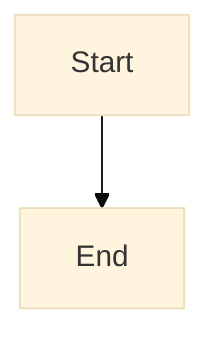
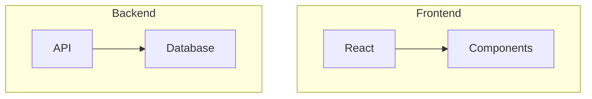
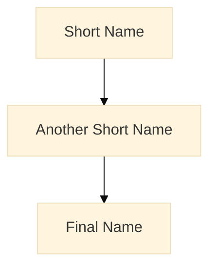
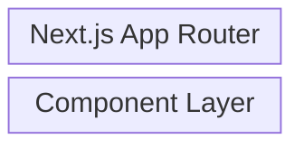

# Mermaid Diagrams - Troubleshooting & Rules

## Implementation Rules

### Do's ✅

- **Używaj komentarzy** - `%% Comment for clarification`
- **Preferuj prostotę** - nie przeładowuj diagramu
- **Aktualizuj razem z kodem** - diagramy muszą być aktualne
- **Testuj renderowanie** - sprawdź w GitHub, Cursor, VS Code
- **Używaj spójnych kolorów** - dla lepszej czytelności
- **Grupuj powiązane elementy** - logiczne grupowanie

### Don'ts ❌

- **Nie używaj zbyt wielu elementów** - max 15-20 na diagram
- **Nie pomijaj tytułów** - każdy diagram musi mieć tytuł
- **Nie używaj zbyt małych fontów** - czytelność jest kluczowa
- **Nie mieszaj typów diagramów** - jeden typ na diagram
- **Nie używaj zbyt wielu kolorów** - 3-4 kolory wystarczą
- **Nie zapominaj o aktualizacji** - przestarzałe diagramy mylą

## Troubleshooting

### Common Issues

#### Diagram nie renderuje się

**Objawy:**

- Pusty blok zamiast diagramu
- Błąd w konsoli przeglądarki
- Brak wyświetlania w GitHub

**Rozwiązania:**

- Sprawdź składnię Mermaid w [Mermaid Live Editor](https://mermaid.live/)
- Upewnij się, że masz tytuł: `title: "Description"`
- Sprawdź czy nie ma błędów w YAML frontmatter
- Zweryfikuj czy wszystkie nawiasy są zamknięte

**Przykład poprawnej składni:**



#### Diagram jest za duży

**Objawy:**

- Nieczytelny na małych ekranach
- Wolne renderowanie
- Trudny w nawigacji

**Rozwiązania:**

- Podziel na mniejsze diagramy (max 15-20 elementów)
- Usuń niepotrzebne elementy
- Użyj prostszej struktury
- Rozważ użycie subgraph dla grupowania

**Przykład podziału:**



#### Diagram jest nieczytelny

**Objawy:**

- Elementy nachodzą na siebie
- Małe fonty
- Słaby kontrast

**Rozwiązania:**

- Dodaj więcej spacji między elementami
- Użyj krótszych nazw (max 20 znaków)
- Sprawdź kolory i kontrast
- Użyj większych fontów w konfiguracji

**Przykład poprawy czytelności:**



#### Diagram nie pasuje do kontekstu

**Objawy:**

- Nie odpowiada na pytanie
- Mylący dla czytelnika
- Nie wspiera tekstu

**Rozwiązania:**

- Sprawdź czy wybrałeś odpowiedni typ diagramu
- Upewnij się, że diagram odpowiada na pytanie
- Rozważ użycie innego typu diagramu
- Dodaj więcej kontekstu w tytule

### Debugging Tips

#### 1. Test w różnych viewerach

- **GitHub**: Sprawdź czy renderuje się w PR/preview
- **Cursor**: Weryfikuj w podglądzie markdown
- **VS Code**: Użyj Mermaid extension
- **Mermaid Live Editor**: Test składni online

#### 2. Używaj Mermaid Live Editor

- [mermaid.live](https://mermaid.live/) - oficjalny editor
- Natychmiastowy podgląd zmian
- Eksport do różnych formatów
- Debugging błędów składni

#### 3. Sprawdź logi

- Otwórz Developer Tools (F12)
- Sprawdź Console na błędy JavaScript
- Szukaj błędów Mermaid parser
- Sprawdź Network tab na brakujące zasoby

#### 4. Uprość diagram

- Usuń skomplikowane elementy
- Testuj z prostym diagramem
- Dodawaj elementy stopniowo
- Sprawdź każdą zmianę

#### 5. Sprawdź dokumentację

- [Mermaid docs](https://mermaid.js.org/) - oficjalna dokumentacja
- [GitHub Mermaid](https://github.com/mermaid-js/mermaid) - issues i PRs
- [Stack Overflow](https://stackoverflow.com/questions/tagged/mermaid) - community help

### Performance Tips

#### 1. Ogranicz liczbę elementów

- **Maksimum**: 15-20 elementów na diagram
- **Optymalnie**: 8-12 elementów
- **Dla dużych systemów**: Podziel na mniejsze diagramy

#### 2. Używaj prostych kształtów

- Unikaj skomplikowanych ikon
- Preferuj podstawowe kształty: `[]`, `()`, `{}`
- Używaj standardowych strzałek: `-->`, `-.->`

#### 3. Minimalizuj tekst

- Używaj skrótów gdzie możliwe
- Maksymalnie 20 znaków na etykietę
- Preferuj symbole nad słowami

#### 4. Optymalizuj konfigurację

```mermaid
%%{init: {
  'theme': 'base',
  'themeVariables': {
    'fontSize': '14px',
    'fontFamily': 'Arial'
  }
}}%%
```

## Best Practices

### 1. Naming Conventions

- **Komponenty**: PascalCase (`UserService`)
- **Funkcje**: camelCase (`getUserData`)
- **Stany**: UPPERCASE (`ACTIVE`, `INACTIVE`)
- **Etykiety**: Krótkie i opisowe (`Login`, `Register`)

### 2. Structure Guidelines

- **Hierarchia**: Od góry do dołu, od lewej do prawej
- **Grupowanie**: Używaj subgraph dla powiązanych elementów
- **Przepływ**: Logiczny przepływ od startu do końca

### 3. Color Guidelines

- **Primary**: Jeden główny kolor (niebieski)
- **Secondary**: Jeden kolor pomocniczy (szary)
- **Accent**: Jeden kolor akcentu (zielony/czerwony)
- **Consistency**: Używaj tych samych kolorów w całym projekcie

### 4. Content Guidelines

- **Tytuł**: Zawsze opisowy i konkretny
- **Etykiety**: Krótkie ale zrozumiałe
- **Komentarze**: Wyjaśniaj skomplikowane części
- **Aktualizacja**: Regularnie sprawdzaj aktualność

## Integration z Workflow Development

### 1. Pre-commit Hooks

```bash
# Sprawdź składnię Mermaid przed commitem
yarn lint:mermaid
```

### 2. CI/CD Pipeline

````yaml
# Walidacja diagramów w CI
- name: Validate Mermaid
  run: |
    find . -name "*.md" -exec grep -l "```mermaid" {} \; | \
    xargs -I {} sh -c 'echo "Validating {}" && mermaid {}'
````

### 3. Documentation Generation

```bash
# Generuj diagramy do dokumentacji
yarn docs:diagrams
```

### 4. Testing

```bash
# Test renderowania diagramów
yarn test:diagrams
```

## Common Error Messages

### "Parse error on line X"

- Sprawdź składnię na linii X
- Upewnij się, że wszystkie nawiasy są zamknięte
- Sprawdź czy nie ma nieprawidłowych znaków

### "Unknown diagram type"

- Sprawdź czy typ diagramu jest poprawny
- Upewnij się, że używasz aktualnej wersji Mermaid
- Sprawdź dokumentację dla dostępnych typów

### "Theme not found"

- Użyj standardowych theme: `base`, `default`, `dark`
- Sprawdź czy theme jest poprawnie zdefiniowany
- Użyj `%%{init: {'theme':'base'}}%%`

### "Node not found"

- Sprawdź czy wszystkie węzły są zdefiniowane
- Upewnij się, że nazwy węzłów są identyczne
- Sprawdź czy nie ma literówek w nazwach

### "block-beta" - Błędne użycie space: i columns

**Problem**: Używanie `space:` w diagramach `block-beta` nie jest zgodne z oficjalną dokumentacją Mermaid.

**Objawy:**

- Diagram nie renderuje się
- Błąd "Unknown syntax" w Mermaid Live Editor
- Nieprawidłowe wyświetlanie w GitHub/Cursor

**Rozwiązanie**: Używaj standardowej składni `block-beta`:

```mermaid
%% ❌ Błędne - nie używaj space:
block-beta
    columns 3
    space:AppRouter["Next.js App Router"]:3
    space:ComponentLayer["Component Layer"]:3
```



**Zasady dla block-beta:**

- Definiuj bloki bezpośrednio: `BlockName["Description"]`
- Dodawaj relacje: `BlockA --> BlockB`
- Nie używaj `space:`

## Resources

### Oficjalne

- [Mermaid Documentation](https://mermaid.js.org/)
- [Mermaid Live Editor](https://mermaid.live/)
- [GitHub Mermaid](https://github.com/mermaid-js/mermaid)

### Community

- [Stack Overflow - Mermaid](https://stackoverflow.com/questions/tagged/mermaid)
- [Reddit - Mermaid](https://www.reddit.com/r/Mermaid/)
- [Discord - Mermaid](https://discord.gg/wwtabKgp8x)

### Tools

- [Mermaid CLI](https://github.com/mermaid-js/mermaid-cli)
- [VS Code Extension](https://marketplace.visualstudio.com/items?itemName=bierner.markdown-mermaid)
- [Obsidian Plugin](https://github.com/obsidianmd/obsidian-releases/releases)
