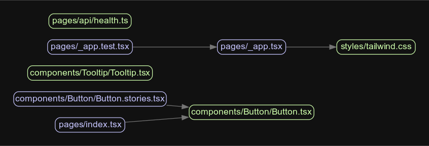
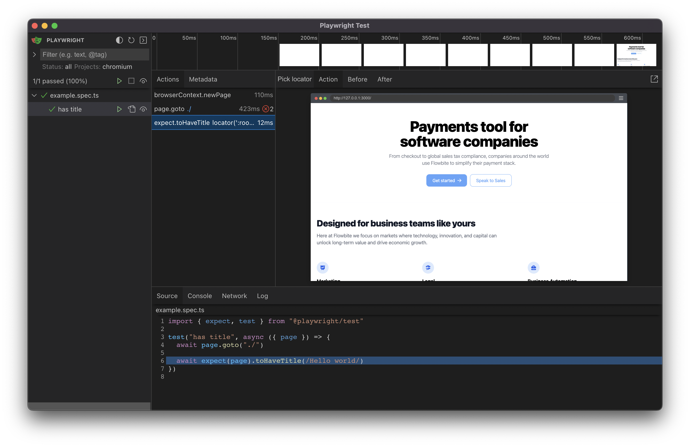

# {{PLACEHOLDER_REPO_NAME}}

<a href="https://github.com/SebastianWesolowski/starter-npm-package"></a>

## Important Links

- [![npm package][npm-img]][npm-url]
- [![Build Status][build-img]][build-url]
- [![GitHub Contributors][github-contributors-badge]][github-contributors-badge-link]
- [Author page]({{PLACEHOLDER_PAGE_AUTHOR}})
- [Git Hooks Documentation](.husky/README.md)

<br/><br/>

**Remove before final release**

- [Set up your repository](docs/HowToAutoDeploy.md)
- [Way to work](docs/WayToWrok.md)
- [Known issues](docs/knowProblems.md)

---

<br/>

{{A template for creating ...}}

### Integrated features

Don't worry, with this template you will anyways get all the awesomeness you need:

- 📦 **[s-update-manager](https://github.com/SebastianWesolowski/s-update-manager)** - Manage your dependencies with centralized repozystory
- 🎨 **[s-customize](https://github.com/{{PLACEHOLDER_GITHUB_USER}}/{{PLACEHOLDER_REPO_NAME}}/tools/customize)** - Customize your repozytory with one command
- 🌐 **[ngrok](https://ngrok.com/)** - For local development with remote services
- 🏎️ **[Next.js 15](https://nextjs.org/)** - Fast by default, with config optimized for performance (with **App Directory**)
- 💅 **[Tailwind CSS](https://tailwindcss.com/)** - A utility-first CSS framework for rapid UI development
- ✨ **[ESlint](https://eslint.org/)** and **[Prettier](https://prettier.io/)** - For clean, consistent, and error-free code
- 🛠️ **[Extremely strict TypeScript](https://www.typescriptlang.org/)** - With [`ts-reset`](https://github.com/total-typescript/ts-reset) library for ultimate type safety
- 🚀 **[GitHub Actions](https://github.com/features/actions)** - Pre-configured actions for smooth workflows, including Bundle Size and performance stats
- 💯 **Perfect Lighthouse score** - Because performance matters
- **[Bundle analyzer plugin](https://www.npmjs.com/package/@next/bundle-analyzer)** - Keep an eye on your bundle size
- **[Jest](https://jestjs.io/)** and **[React Testing Library](https://testing-library.com/react)** - For rock-solid unit and integration tests
- **[Playwright](https://playwright.dev/)** - Write end-to-end tests like a pro
- **[Storybook](https://storybook.js.org/)** - Create, test, and showcase your components
- **Smoke Testing** and **Acceptance Tests** - For confidence in your deployments
- **[Conventional commits git hook](https://www.conventionalcommits.org/)** - Keep your commit history neat and tidy
- **[Absolute imports](https://nextjs.org/docs/advanced-features/module-path-aliases)** - No more spaghetti imports
- **[Health checks](https://kubernetes.io/docs/tasks/configure-pod-container/configure-liveness-readiness-startup-probes/)** - Kubernetes-compatible for robust deployments
- **[Radix UI](https://www.radix-ui.com/)** - Headless UI components for endless customization
- **[CVA](http://cva.style/)** - Create a consistent, reusable, and atomic design system
- **[Renovate BOT](https://www.whitesourcesoftware.com/free-developer-tools/renovate)** - Auto-updating dependencies, so you can focus on coding
- **[Patch-package](https://www.npmjs.com/package/patch-package)** - Fix external dependencies without losing your mind
- **Components coupling and cohesion graph** - A tool for managing component relationships
- **[Semantic Release](https://github.com/semantic-release/semantic-release)** - for automatic changelog
- **[T3 Env](https://env.t3.gg/)** - Manage your environment variables with ease
- **[Husky](https://typicode.github.io/husky/)** - Git hooks made easy (see [Git Hooks Documentation](.husky/README.md))

## Table of Contents

- [Integrated features](#integrated-features)
- [Table of Contents](#table-of-contents)
- [Getting Started](#-getting-started)
- [Deployment](#-deployment)
- [Scripts Overview](#-scripts-overview)
- [Coupling Graph](#-coupling-graph)
- [Testing](#-testing)
  - [Running Tests](#running-tests)
  - [Acceptance Tests](#acceptance-tests)
  - [Smoke Testing](#smoke-testing)
- [Styling and Design System](#-styling-and-design-system)
  - [CVA - A New Approach to Variants](#cva---a-new-approach-to-variants)
- [State Management](#-state-management)
  - [Zustand](#zustand)
  - [Jotai](#jotai)
  - [Recoil](#recoil)
- [Environment Variables handling](#-environment-variables-handling)
- [Contribution](#-contribution)
- [Support](#support)
- [License](#-license)
- [Contributors](#contributors)

## 🎯 Getting Started

To get started with this boilerplate, follow these steps:

1. Install the dependencies:
```bash
yarn install
```

2. Run the update with s-update-manager:
```bash
yarn s-update-manager
```

3. Customize your repository:

> [Repository Customization](./docs/WayToWrok.md#set-up-your-repository) - Personalize your project with custom details

```bash
yarn customize
```

4. Run the development server:
```bash
yarn dev
```

5. Open [http://localhost:3000](http://localhost:3000) with your browser to see the result.

- [Ngrok Integration](./docs/WayToWrok.md#optional) - Expose your local server to the internet
- [Local Preview](./docs/WayToWrok.md#check-local-preview-package) - Test your build locally

## 🔗 Detailed Documentation

For detailed instructions and advanced options, please refer to [How to Work with Template](./docs/WayToWrok.md):


## 🚀 Deployment

Easily deploy your Next.js app with [Vercel](https://vercel.com/new?utm_medium=default-template&filter=next.js) by clicking the button below:

[](https://vercel.com/new/git/external?repository-url=PLACEHOLDER_REPO_URL)

### GitFlow

- [Development Workflow](./docs/WayToWrok.md#-development-and-setup) - Complete setup instructions
- [Pre-release Process](./docs/WayToWrok.md#pre-release) - From feature and dev branches
- [Pre-production Setup](./docs/WayToWrok.md#pre-production) - Via pull requests to main
- [Release Workflow](./docs/WayToWrok.md#release) - Automated with GitHub Actions

## 📃 Scripts Overview

The template project includes a variety of configured scripts divided into logical categories:

### 🚀 Development & Running

- `dev` - Runs Next.js development server with turbo
- `dev:storybook` - Runs development server and Storybook concurrently
- `dev:tunnel` - Runs development server with ngrok exposure
- `dev:build` - Builds production app and runs it locally
- `build:analyze` - Builds app with bundle size analysis

### 🏗️ Building

- `build` - Builds app for deployment
- `build:prod` - Builds production app with additional final steps
- `build:prebuild` - Prepares environment before building (cleaning and copying assets)
- `build:postbuild` - Executes post-build tasks (e.g. sitemap generation)

### 🧪 Testing

- `test` - Runs all tests (unit, component, snapshot, smoke, e2e)
- `test:unit` - Runs Jest unit tests
- `test:components` - Runs React component tests
- `test:snapshot` - Runs UI snapshot comparison tests
- `test:smoke` - Runs smoke tests in Storybook
- `test:e2e` - Runs Playwright end-to-end tests
- `test:e2e:ui` - Runs end-to-end tests in UI mode

### 🔍 Linting & Formatting

- `lint` - Runs all code checking tools
- `lint:check` - Checks code correctness without making changes
- `lint:fix` - Automatically fixes code issues
- `lint:prettier:check/fix` - Checks/fixes formatting with Prettier
- `lint:eslint:check/fix` - Checks/fixes code with ESLint
- `lint:style:check/fix` - Checks/fixes CSS styles with Stylelint
- `lint:typescript:check` - Checks TypeScript types

### 📊 Code Quality

- `quality:knip` - Detects unused code in project
- `quality:coverage` - Generates test coverage report
- `quality:coupling:graph` - Creates visualization of module dependencies
- `quality:coupling:json` - Exports dependency data to JSON format

### 📚 Storybook

- `storybook` - Runs Storybook server
- `storybook:build` - Builds static Storybook for deployment

### 🛠️ Tools & Configuration

- `customize` - Runs project customization script
- `update-template` - Updates project from central template repository
- `ngrok` - Exposes local server through ngrok

## 🔗 Coupling Graph

The `coupling-graph` script is a useful tool that helps visualize the coupling and connections between your project's internal modules. It's built using the [Madge](https://github.com/pahen/madge) library. To generate the graph, simply run the following command:

```bash
yarn coupling-graph
```

This will create a `graph.svg` file, which contains a graphical representation of the connections between your components. You can open the file with any SVG-compatible viewer.



## 🧪 Testing

This boilerplate comes with various testing setups to ensure your application's reliability and robustness.

### Running Tests

- **Unit and integration tests**: Run Jest tests using `yarn test`
- **End-to-end tests (headless mode)**: Run Playwright tests in headless mode with `yarn test:e2e`
- **End-to-end tests (UI mode)**: Run Playwright tests with UI using `yarn test:e2e:ui`




### Acceptance Tests

To write acceptance tests, we leverage Storybook's [`play` function](https://storybook.js.org/docs/react/writing-stories/play-function#writing-stories-with-the-play-function). This allows you to interact with your components and test various user flows within Storybook.

```ts
/*
 * See https://storybook.js.org/docs/react/writing-stories/play-function#working-with-the-canvas
 * to learn more about using the canvasElement to query the DOM
 */
export const FilledForm: Story = {
  play: async ({ canvasElement }) => {
    const canvas = within(canvasElement);

    const emailInput = canvas.getByLabelText('email', {
      selector: 'input',
    });

    await userEvent.type(emailInput, 'example-email@email.com', {
      delay: 100,
    });

    const passwordInput = canvas.getByLabelText('password', {
      selector: 'input',
    });

    await userEvent.type(passwordInput, 'ExamplePassword', {
      delay: 100,
    });
    // See https://storybook.js.org/docs/react/essentials/actions#automatically-matching-args to learn how to setup logging in the Actions panel
    const submitButton = canvas.getByRole('button');

    await userEvent.click(submitButton);
  },
};
```

### Smoke Testing

In this boilerplate, we use Storybook's out-of-the-box support for smoke testing to verify that components render correctly without any errors. Just run `yarn test:smoke` to perform smoke testing. Remember to write stories in JSX or TSX format only. Smoke testing and a lot of other functionalities dont work well with MDX stories.

## 🎨 Styling and Design System

This boilerplate uses Tailwind CSS for styling and CVA for creating a powerful, easy-to-use design system. If you want to learn more about the setup, check out this fantastic video by Vercel:

[](https://www.youtube.com/watch?v=T-Zv73yZ_QI&ab_channel=Vercel)

### CVA - A New Approach to Variants

While CSS-in-TS libraries such as [Stitches](https://stitches.dev/) and [Vanilla Extract](https://vanilla-extract.style/) are great for building type-safe UI components, they might not be the perfect fit for everyone. You may prefer more control over your stylesheets, need to use a framework like Tailwind CSS, or simply enjoy writing your own CSS.

Creating variants using traditional CSS can be a tedious task, requiring you to manually match classes to props and add types. CVA is here to take that pain away, allowing you to focus on the enjoyable aspects of UI development. By providing an easy and type-safe way to create variants, CVA simplifies the process and helps you create powerful design systems without compromising on the flexibility and control of CSS.

## 💾 State Management

While this boilerplate doesn't include a specific state management library, we believe it's essential for you to choose the one that best suits your project's needs. Here are some libraries we recommend for state management:

### Zustand

[Zustand](https://github.com/pmndrs/zustand) is a small, fast, and scalable state management library. It's designed to be simple and intuitive, making it a great choice for small to medium-sized projects. It's also optimized for bundle size, ensuring minimal impact on your app's performance.

### Jotai

[Jotai](https://github.com/pmndrs/jotai) is an atom-based state management library for React that focuses on providing a minimal and straightforward API. Its atom-based approach allows you to manage your state in a granular way while still being highly optimized for bundle size.

### Recoil

[Recoil](https://recoiljs.org/) is a state management library developed by Facebook, specifically designed for React applications. By utilizing atoms and selectors, Recoil allows you to efficiently manage state and derived state. Its key benefit is the ability to update components only when the state they're subscribed to changes, reducing unnecessary re-renders and keeping your application fast and efficient. Recoil also offers great developer experience with built-in debugging tools.

Choose the library that best fits your requirements and project structure to ensure an efficient state management solution for your application.

## 💻 Environment Variables handling

[T3 Env](https://env.t3.gg/) is a library that provides environmental variables checking at build time, type validation and transforming. It ensures that your application is using the correct environment variables and their values are of the expected type. You'll never again struggle with runtime errors caused by incorrect environment variable usage.

Config file is located at `env.mjs`. Simply set your client and server variables and import `env` from any file in your project.

```ts
export const env = createEnv({
  server: {
    // Server variables
    SECRET_KEY: z.string(),
  },
  client: {
    // Client variables
    API_URL: z.string().url(),
  },
  runtimeEnv: {
    // Assign runtime variables
    SECRET_KEY: process.env.SECRET_KEY,
    API_URL: process.env.NEXT_PUBLIC_API_URL,
  },
});
```

If the required environment variables are not set, you'll get an error message:

```sh
  ❌ Invalid environment variables: { SECRET_KEY: [ 'Required' ] }
```

## Badges

[![Downloads][downloads-img]][downloads-url]
[![Issues][issues-img]][issues-url]
[![Commitizen Friendly][commitizen-img]][commitizen-url]
[![Semantic Release][semantic-release-img]][semantic-release-url]
[![GitHub License][github-license-badge]][github-license-badge-link]


[build-img]: https://github.com/{{PLACEHOLDER_GITHUB_USER}}/{{PLACEHOLDER_REPO_NAME}}/actions/workflows/release.yml/badge.svg
[build-url]: https://github.com/{{PLACEHOLDER_GITHUB_USER}}/{{PLACEHOLDER_REPO_NAME}}/actions/workflows/release.yml
[downloads-img]: https://img.shields.io/npm/dt/{{PLACEHOLDER_REPO_NAME}}
[downloads-url]: https://www.npmtrends.com/{{PLACEHOLDER_REPO_NAME}}
[npm-img]: https://img.shields.io/npm/v/{{PLACEHOLDER_REPO_NAME}}
[npm-url]: https://www.npmjs.com/package/{{PLACEHOLDER_REPO_NAME}}
[issues-img]: https://img.shields.io/github/issues/{{PLACEHOLDER_GITHUB_USER}}/{{PLACEHOLDER_REPO_NAME}}
[issues-url]: https://github.com/{{PLACEHOLDER_GITHUB_USER}}/{{PLACEHOLDER_REPO_NAME}}/issues
[semantic-release-img]: https://img.shields.io/badge/%20%20%F0%9F%93%A6%F0%9F%9A%80-semantic--release-e10079.svg
[semantic-release-url]: https://github.com/semantic-release/semantic-release
[commitizen-img]: https://img.shields.io/badge/commitizen-friendly-brightgreen.svg
[commitizen-url]: http://commitizen.github.io/cz-cli/
[github-license-badge]: https://img.shields.io/github/license/{{PLACEHOLDER_GITHUB_USER}}/{{PLACEHOLDER_REPO_NAME}}
[github-license-badge-link]: https://github.com/{{PLACEHOLDER_GITHUB_USER}}/{{PLACEHOLDER_REPO_NAME}}/blob/main/LICENSE


[github-contributors-badge]: https://img.shields.io/github/contributors/{{PLACEHOLDER_GITHUB_USER}}/{{PLACEHOLDER_REPO_NAME}}
[github-contributors-badge-link]: https://github.com/{{PLACEHOLDER_GITHUB_USER}}/{{PLACEHOLDER_REPO_NAME}}/graphs/contributors
