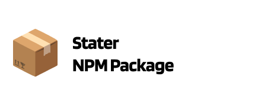

# PLACEHOLDER_REPO_NAME

<a href="https://github.com/SebastianWesolowski/starter-npm-package"></a>

## Important Links

- [![npm package][npm-img]][npm-url]
- [![Build Status][build-img]][build-url]
- [Author page](PLACEHOLDER_PAGE_AUTHOR)

<br>

**Remove before final release**
- [Set up your repository](docs/HowToAutoDeploy.md)
- [Way to work](docs/WayToWrok.md)
- [Known issues](docs/knowProblems.md)

---

<br/>

A template for creating npm packages using TypeScript

## Install

```bash
npm install PLACEHOLDER_REPO_NAME
```

## Usage

```ts
import { myPackage } from "PLACEHOLDER_REPO_NAME";

// Default value is 'Watermelon 🍉'
getFavoriteFruit();
//=> 'My favorite fruit is Watermelon 🍉'

getFavoriteFruit('Apple 🍎');
//=> 'My favorite fruit is Apple 🍎'
```

## API

### getFavoriteFruit(fruit?)

Returns a string with your favorite fruit.

#### fruit

Type: `string`
Default: `'Watermelon 🍉'`

The fruit to use in the returned string. Must be a string value.

#### Returns

Type: `string`

Returns a string in the format: `'My favorite fruit is {fruit}'`

#### Throws

Throws an error if the fruit parameter is not a string.

#### Example

Lorem ipsum.

## Badges
[![Downloads][downloads-img]][downloads-url]
[![Issues][issues-img]][issues-url]
[![Commitizen Friendly][commitizen-img]][commitizen-url]
[![Semantic Release][semantic-release-img]][semantic-release-url]


[build-img]: https://github.com/PLACEHOLDER_GITHUB_USER/PLACEHOLDER_REPO_NAME/actions/workflows/release.yml/badge.svg
[build-url]: https://github.com/PLACEHOLDER_GITHUB_USER/PLACEHOLDER_REPO_NAME/actions/workflows/release.yml
[downloads-img]: https://img.shields.io/npm/dt/PLACEHOLDER_REPO_NAME
[downloads-url]: https://www.npmtrends.com/PLACEHOLDER_REPO_NAME
[npm-img]: https://img.shields.io/npm/v/PLACEHOLDER_REPO_NAME
[npm-url]: https://www.npmjs.com/package/PLACEHOLDER_REPO_NAME
[issues-img]: https://img.shields.io/github/issues/PLACEHOLDER_GITHUB_USER/PLACEHOLDER_REPO_NAME
[issues-url]: https://github.com/PLACEHOLDER_GITHUB_USER/PLACEHOLDER_REPO_NAME/issues
[semantic-release-img]: https://img.shields.io/badge/%20%20%F0%9F%93%A6%F0%9F%9A%80-semantic--release-e10079.svg
[semantic-release-url]: https://github.com/semantic-release/semantic-release
[commitizen-img]: https://img.shields.io/badge/commitizen-friendly-brightgreen.svg
[commitizen-url]: http://commitizen.github.io/cz-cli/
